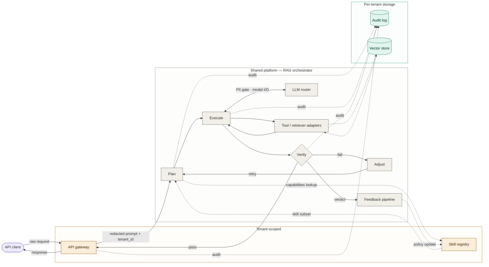

# explain-the-repo

An [Agent Skill](https://docs.claude.com/en/docs/claude-code/skills) for Claude Code that produces architecture documentation explaining a codebase to a stranger — combining prose sections (component summaries, data flow, lifecycle, deployment notes) with multi-diagram Mermaid sets where visual representation is load-bearing.

Status: experimental, v0.4 (renamed from `system-diagram-in-mermaid` in v0.4.0 — see [Lineage](#lineage) below). See [Limitations](#limitations) before depending on it.

## What this fixes

The default failure mode for AI-generated architecture docs is one of two extremes: a wall of prose with no visual grounding, or a single sprawling diagram with no surrounding explanation. Both fail the stranger trying to onboard. A good architecture doc interleaves prose and diagrams, each load-bearing in its own way, each grounded in specific files in the codebase.

This skill encodes a two-level procedure that designs the doc as a whole before writing any of it.

**Outer loop — Phase A (doc design pass).** Decide what *sections* the doc needs (headline, where-to-start, architecture overview, component summaries, lifecycle, data flow, state and persistence, glossary, out-of-scope). Default doc shape is 3 sections (headline + architecture overview + where-to-start); add sections only when the system has properties the default can't honestly cover. Cap at 8–10 sections.

**Outer loop — Phase B (per-section generation).** For each section: prose sections get written and grounded in specific files; diagram-set sections invoke the inner diagram procedure.

**Outer loop — Phase C (doc-level review).** When the doc has more than 3 sections, a doc-panel subagent reviews the assembled doc for coherence, completeness, and prose-diagram agreement. Bounded one-round revision applies revision-worthy issues per a filter table.

**Inner loop — diagram procedure.** Used by Phase B for diagram-set sections, and standalone for "draw a diagram of X" requests. The inner loop replaces "draw boxes for every component you see" with a six-step procedure:

1. **Diagram-set design pass** — decide the *set* of diagrams the section needs (1–5 siblings; cadence, zoom, topology, lifecycle, failure siblings).
2. **Plan the trace in plain text** — concrete entry point, ordered path, semantic axis, out-of-scope fence.
3. **Map to Mermaid primitives.**
4. **Render with elk, not dagre.**
5. **If iterating on an existing messy diagram, diagnose first.**
6. **Panel critique + syntax lint + bounded revision.** Three parallel subagents: two panel critiques (four-panelist semantic review, voted by union) and one syntax linter (parser-footgun scanner).

The user can opt out of the doc-level and diagram-level panels with phrases like "quick diagram" / "no critique" / "rough overview"; the syntax linter always runs.

## Before / after

A canonical example: drawing a request-flow diagram for a multi-tenant retrieval-augmented generation (RAG) service.

### Before — a typical AI-generated first attempt

Without procedural guidance, an AI assistant typically produces something like:

- 14+ boxes representing every named component, all roughly equal weight
- Components stacked in horizontal layers ("frontend / app / data") even when call order doesn't match the layering
- Color used decoratively — adjacent boxes share a color because they happen to be in the same row, not because they share a category
- Cross-cutting concerns (auth, PII redaction, rate limiting, audit logging) drawn as peer boxes with their own arrows, creating false call relationships
- Multi-write sinks (audit logs, metrics) drawn as separate writes from each component, multiplying edge clutter
- No labeled response path back to the user
- Trust boundaries implied by spatial grouping but not encoded

The result looks complete but doesn't help a reader understand how a request actually flows. See [`examples/anti-patterns.md`](examples/anti-patterns.md) for the failure modes in detail.

### After — same architecture, drawn under this skill's procedure



What changed:
- One trace, end to end (client → audit log → response back to client)
- Three subgraphs encode trust boundaries (tenant-scoped, shared platform, per-tenant storage)
- PII redaction sits *on* the edge it intercepts, not as a floating box
- The audit log is one sink with multiple dotted incoming arrows, not four redundant writes
- The cross-run feedback loop is drawn as a separate dotted edge, visually distinct from the request flow
- Verify is drawn as a decision diamond — the architectural choice (pass / fail / retry) is structural, not buried in a subtitle

See [`examples/walkthrough.md`](examples/walkthrough.md) for the full plan-then-source workflow on this example.

> **Note on rendering:** GitHub's native Mermaid renders this with dagre, which produces a noticeably more tangled layout than elk. For the cleanest result, paste the source into [Mermaid Live Editor](https://mermaid.live) with the elk renderer enabled, or render in an environment that supports `defaultRenderer: 'elk'`. See [Rendering caveats](#rendering-caveats) below.

## Try it

Two reproducible test prompts — paste either into Claude Code with the skill installed.

**Doc-level test** (the primary surface):

> *"Explain my repo at ~/some/codebase — give me an architecture doc I can hand to a new engineer."*

With the skill installed, Claude should run a doc design pass first (proposing 3–8 sections including headline, where-to-start, architecture overview, and component summaries), surface the plan for sanity check, then generate the doc with embedded Mermaid diagram sets. See [`examples/real-repos/autoresearch.md`](examples/real-repos/autoresearch.md) for what a complex multi-diagram doc looks like; [`examples/real-repos/graphql-node.md`](examples/real-repos/graphql-node.md) for a minimal 4-section single-diagram doc.

**Diagram-only test** (the inner procedure standalone):

> *"Draw a system diagram for a request flowing through a multi-tenant retrieval-augmented generation service. The platform has an API gateway that does PII redaction, a shared orchestrator with plan/execute/verify/adjust stages, an LLM router with cost tiers, retriever adapters that hit a tenant-scoped vector store, an eval harness, a feedback pipeline that updates a skill registry, and a per-tenant hash-chained audit log."*

The inner diagram procedure runs without the doc-level wrapper. Output: a single-diagram set with a plan, Mermaid source, notes, and a panel summary.

If either fails to behave as described, [open an issue](https://github.com/jyouturner/system-diagram-in-mermaid/issues) — that's exactly the kind of feedback this project needs.

## Install

User-level (available across all projects):

```bash
git clone https://github.com/jyouturner/system-diagram-in-mermaid.git \
  ~/.claude/skills/explain-the-repo
```

Project-level (vendored into a single repo):

```bash
git clone https://github.com/jyouturner/system-diagram-in-mermaid.git \
  .claude/skills/explain-the-repo
```

Claude Code auto-discovers skills under `~/.claude/skills/` and `<project>/.claude/skills/`. The skill description tells Claude when to invoke it — you don't need to call it explicitly.

To verify it's installed:
```bash
ls ~/.claude/skills/explain-the-repo/SKILL.md
```

(The repo currently lives at the URL `system-diagram-in-mermaid` for historical reasons; the *skill* is `explain-the-repo`. The git remote rename is a follow-up.)

## Files

- [`SKILL.md`](SKILL.md) — the outer skill definition (Phase A doc design pass, Phase B per-section generation, Phase C doc-level review).
- [`references/diagram-procedure.md`](references/diagram-procedure.md) — the inner diagram procedure (steps 0–6) used by Phase B for diagram-set sections; usable standalone for diagram-only requests.
- [`references/doc-design-pass.md`](references/doc-design-pass.md) — section taxonomy and decision rules for Phase A.
- [`references/doc-panel-prompt.md`](references/doc-panel-prompt.md) — doc-level coherence critique used by Phases A and C.
- [`references/diagram-set-design-pass.md`](references/diagram-set-design-pass.md) — within-section sibling rules for the diagram procedure's step 0.
- [`references/diagram-set-panel-prompt.md`](references/diagram-set-panel-prompt.md) — within-section diagram-set critique.
- [`references/panel-prompt.md`](references/panel-prompt.md) — four-panelist per-diagram critique used by the diagram procedure's step 6.
- [`references/syntax-lint-prompt.md`](references/syntax-lint-prompt.md) — Mermaid parser-footgun checklist used by step 6.
- [`references/diagnostic-checklist.md`](references/diagnostic-checklist.md) — diagram-level failure modes for iteration mode.
- [`references/mermaid-patterns.md`](references/mermaid-patterns.md) — Mermaid idioms (subgraphs, classDef, linkStyle, syntax footguns, standalone HTML render template).
- [`design/`](design/) — design rationale (`refinement-loop.md` and `integrated-flow-sketch.md` cover the panel-critique loop and the phase-C integration; the `explain-the-repo` rename is documented in CHANGELOG).
- [`examples/`](examples/) — worked examples (`walkthrough.md` walks the inner diagram procedure; `real-repos/` shows the doc skill applied to actual codebases).
- [`evals/evals.json`](evals/evals.json) — test prompts for evaluating the skill at both levels (doc-level + diagram-only).

## When it triggers

Claude will invoke this skill on requests like:

**Doc-level (the primary surface):**
- "Explain this repo / codebase / project"
- "Architecture of [project]" / "system overview of [service]"
- "What does this codebase do" / "how does this work end to end"
- "Onboard a new engineer to [repo]" / "documentation for the team"
- "Document this service" / "give me an architecture doc"

**Diagram-only (the inner procedure standalone):**
- "Draw a diagram of [system]" / "request flow for [feature]"
- "Show me how [X] works"
- "What does [agent / pipeline / service mesh] look like end to end"
- "This diagram is messy, can you redraw it" (iteration mode)

It will *not* trigger for:
- ER diagrams → use Mermaid `erDiagram` directly
- Sequence diagrams of pure message exchange → use Mermaid `sequenceDiagram`
- State machines → use Mermaid `stateDiagram-v2`
- UI mockups, decision trees, or pure logic flowcharts
- API references → use OpenAPI / typedoc / similar
- Code-level documentation (function-by-function comments) → different shape

## Lineage

This project started life as `system-diagram-in-mermaid` (v0.1–v0.3) — a focused skill for producing legible Mermaid system diagrams. v0.4.0 renamed it to `explain-the-repo` after the diagram-set work made clear that what users actually wanted was an *architecture document* containing diagrams, not diagrams alone. The diagram procedure is preserved as the inner loop; what's new in v0.4 is the outer doc-level wrapper. See `CHANGELOG.md` for the full history.

## Limitations

Things this skill does not do well, as of v0.4:

- **One zoom level for diagrams.** The diagram procedure operates at roughly the C4 "container" level — services, components, and their interactions in a single system. Multi-level diagrams (system context → containers → components → code) aren't supported. For that, look at [Structurizr](https://structurizr.com/) or [C4-PlantUML](https://github.com/plantuml-stdlib/C4-PlantUML).
- **Mermaid only for diagrams.** No support for D2, Structurizr DSL, PlantUML, or Graphviz.
- **GitHub renders dagre, not elk.** Mermaid in GitHub READMEs uses dagre. The diagram-procedure's routing-quality claims assume elk. See [Rendering caveats](#rendering-caveats) below.
- **The doc design pass is heuristic.** The "is this complex enough to need siblings?" and "does this doc need a Lifecycle section?" decisions are based on rules of thumb. Real-world traffic will tell us where they're wrong.
- **Doc-level depth scales with token budget.** A 7-section doc with multi-diagram architecture overviews can easily run 10× the tokens of a single-shot diagram. The opt-out path ("quick overview", "no critique") is for when this matters.
- **Not benchmarked at scale.** v0.4 ships with a small `evals/` directory of test prompts but has not been tested across many models, prompts, or domains. Treat outputs as a v1, review before shipping to anything important.

## Rendering caveats

The skill's claim that "elk minimizes edge crossings" depends on the renderer the user actually uses. Mermaid v10+ supports elk via:

```javascript
mermaid.initialize({
  flowchart: { defaultRenderer: 'elk' }
});
```

| Environment | Default renderer | Quality |
|---|---|---|
| GitHub README | dagre | Acceptable, more crossings |
| GitLab README | dagre | Same as GitHub |
| Mermaid Live Editor (`mermaid.live`) | configurable | Good with elk |
| Obsidian | dagre by default, elk via plugin | Good with plugin |
| VS Code preview | depends on extension | Varies |
| Custom HTML page | whatever you configure | Best with elk |

For diagrams you intend to share via GitHub README, expect a tangled layout relative to the live-editor preview. This is a Mermaid limitation, not a skill limitation, but it's worth knowing up front.

A standalone HTML render template that uses elk is included in [`references/mermaid-patterns.md`](references/mermaid-patterns.md).

## Evaluation

The `evals/evals.json` file contains a small set of test prompts that exercise different diagram archetypes (request trace, batch pipeline, iteration-mode redraw, out-of-scope cases). To run them with the [skill-creator](https://github.com/anthropics/skills) workflow, use that skill's evaluation loop — this repo doesn't ship its own runner.

If you contribute new evals, please include both the prompt and a short note on what the resulting diagram should and should not contain.

## Contributing

See [`CONTRIBUTING.md`](CONTRIBUTING.md). Short version: issues are welcome, especially:
- Diagrams the skill produces that look wrong (please attach prompt + output)
- Diagram archetypes the skill mishandles (please describe the archetype)
- Suggestions for the diagnostic checklist or pattern reference
- Test prompts to add to `evals/`

## Versioning

This project follows semver-ish: minor versions for procedure changes, patch versions for reference-material updates, major versions for breaking changes to skill triggering or output format. See [`CHANGELOG.md`](CHANGELOG.md).

## License

MIT — see [`LICENSE`](LICENSE).
