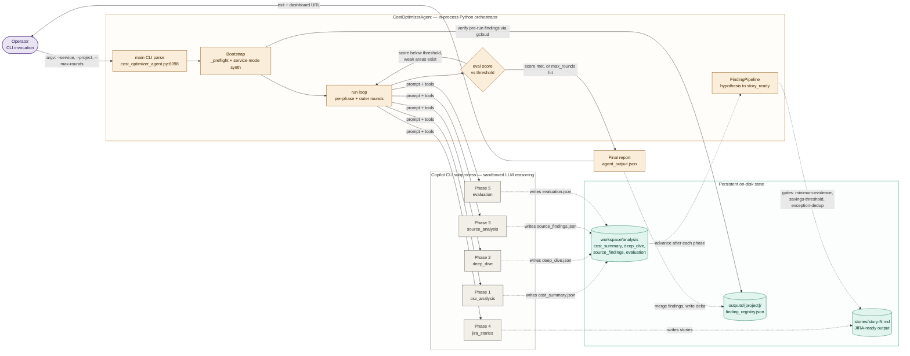
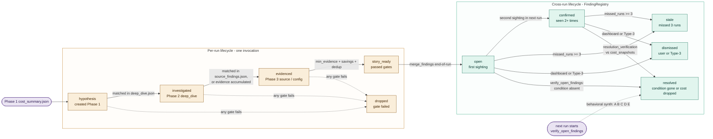

# Cloud Cost Optimizer Agent — architecture

The Cloud Cost Optimizer Agent (`cost_optimizer_agent.py`) is a pure-Python orchestrator that drives a 5-phase cost-investigation pipeline by delegating each LLM-reasoning step to a GitHub Copilot CLI subprocess. The agent itself owns phase sequencing, retry policy, finding state machines, cross-run dedup, and budget enforcement; the LLM does the cost analysis, code review, and story writing inside the sandboxed Copilot subprocess. The architecturally interesting property is that the agent persists a **cross-run finding registry** (`outputs/{project}/finding_registry.json`) so that on the next run it auto-verifies which open findings still hold, dismisses what the team has already addressed, and focuses LLM effort on what's new — turning each run into an incremental delta rather than a fresh investigation.

## Where to start reading

- **`cost_optimizer_agent.py`** — the orchestrator. `class CostOptimizerAgent` (line 863) is the system; `run()` (line 4932) is the main loop; `_run_phase()` (line 4787) is the per-phase execution unit; `_build_phases()` (line 282) defines the five phases. ~6,500 lines, but most of it is helper methods on `CostOptimizerAgent`.
- **`models.py`** — the data structures. Read this first for vocabulary: `Finding` and its lifecycle (`FINDING_STATES`, `VALID_TRANSITIONS`, line 282–290), `COST_SIGNAL_TYPES`, `VERDICT_TYPES`, `CLOUD_PROFILES`, `BackendResult`, `InvestigationBrief`, `DecisionLog`. ~590 lines, mostly declarations.
- **`pipeline.py`** — the finding lifecycle and skill system. `FindingPipeline` (line 139) advances Findings through hypothesis → investigated → evidenced → story_ready. `SkillRegistry` (line 907) loads `skills/{name}/` playbooks and matches them to cost drivers. `synthesize_investigations()` (line 2156) is Stage 4 of orchestrated deep-dive.
- **`registries.py`** — persistent state across runs. `FindingRegistry` (line 1008) is the cross-run dedup + lifecycle store; `LearningEngine` (line 1410) accumulates verdict patterns; `ExceptionRegistry` (line 721) tracks intentional spend; `BehavioralVerdictSynthesizer` (line 1941) infers verdicts from team actions.
- **`executors.py`** — the LLM backends. `InvestigationExecutor` (line 142) is the abstraction; `ClassicExecutor` (line 177) wraps the in-process tool loop; `CopilotNativeExecutor` (line 372) shells out to `copilot --agent <name>`; `CopilotBackend` (line 844) is the lower-level subprocess driver used by phase prompts.
- **`README.md`** — the user-facing tour. The "How it works" ASCII diagram and "Key features" sections are the fastest way to see what the agent does end-to-end before diving into the code.

## Architecture overview

The diagram set has three diagrams: a request trace through one run (D1), a zoom on Phase 2's orchestrated specialist cadence (D2), and a state-topology sibling that maps the persistent stores (D3). The semantic axis across all three is the **agent / Copilot subprocess / persistent state** trust boundary — the agent is in-process Python, Copilot subprocesses are sandboxed external processes, and persistent state lives on disk.

### D1 — Per-run pipeline trace

Concrete entry point: `python cost_optimizer_agent.py --service "BigQuery,Dataflow" --project my-project-prod --max-rounds 2 --budget 10.00`.

The five phases are defined in `_build_phases()` (`cost_optimizer_agent.py:282`). Each phase has a prompt, a primary deliverable, and a `critical` flag. `_run_phase()` (`cost_optimizer_agent.py:4787`) handles the 3-attempt escalating retry: attempt 1 is the normal prompt; attempt 2 retries with validation errors; attempt 3 is repair mode. Phases 3–5 are `critical=False` (graceful degradation — Phase 5 can score whatever stories Phase 4 produced). The outer refinement loop (`run()` line 5184) re-runs weak phases when `evaluation`'s overall_score is below `quality_threshold`, up to `max_rounds` rounds.

The trace closes back to the operator; the outer-loop iteration is drawn as a self-edge on `run loop` via the `eval_check` decision diamond (the architecturally interesting choice — a single quality-gate routes both to refinement and to termination). The pre-phase auto-verification path (the agent re-checks open findings from previous runs via scripted `gcloud` commands before Phase 1) is the dotted edge from `boot` to `reg`.

**Plan / out of scope for D1.** The orchestrated Phase-2 cadence (discovery → triage → specialist → synthesis) is collapsed into the `p2` node here and exploded in D2. Cross-run learning, dashboard, and behavioral verdicts are out of D1's scope and appear in D3.

**Per-diagram panel summary (self-graded, validation run).** Trace closes (operator → exit). Trust axis = agent / subprocess / disk; classes consistent with subgraphs. Decision diamond `eval_check` makes the refinement-loop choice visible structurally. Architecturally load-bearing choices surfaced: outer loop self-edge, pre-phase verification dotted arrow. Borderline: 12 nodes is at the upper edge of clean; tradeoff accepted because each node is load-bearing for the trace.

### D2 — Phase 2 orchestrated specialist cadence

Concrete entry point: a run with BigQuery and Cloud Logging in the matched skills list. BigQuery has `skills/bigquery/scripts/discover.py` + `triage.py` so it triggers orchestration (`_should_orchestrate()` at `cost_optimizer_agent.py:1270`); Cloud Logging has no scripts so it falls back to single-call deep-dive.

```mermaid
flowchart LR
  in([deep_dive phase entry<br/>matched skills list])

  decide{"any skill has<br/>scripts/discover*.py"}

  subgraph SCRIPTED [" Orchestrated path  -  per skill "]
    direction TB
    disc[Stage 1<br/>discover.py]
    enrich[Stage 1.5 enrich.py<br/>optional]
    triage[Stage 2<br/>triage.py]
    qw[quick_wins<br/>direct findings]
    dd_q[deep_dive_queue<br/>candidates]
    spec[Stage 3 specialist<br/>InvestigationExecutor]
    inv[("inventory.json")]
    plan[("investigation_plan.json")]
  end

  subgraph SUBPROC [" Copilot subprocess  -  per specialist "]
    direction TB
    cn["copilot --agent<br/>{skill}-specialist"]
    classic["ClassicExecutor<br/>tool loop fallback"]
  end

  subgraph FALLBACK [" Single-call path  -  non-scripted "]
    direction TB
    single[single-call deep_dive<br/>full LLM investigation]
  end

  synth[Stage 4 synthesis<br/>synthesize_investigations]
  out[("analysis/deep_dive.json<br/>investigations array")]

  in --> decide
  decide -->|"has scripts"| disc
  decide -->|"no scripts"| single
  disc -.->|writes| inv
  inv --> enrich
  enrich -.->|writes| inv
  inv --> triage
  triage -.->|writes| plan
  plan --> qw
  plan --> dd_q
  qw -->|"filter by min_cost_threshold"| synth
  dd_q -->|"InvestigationBrief"| spec
  spec -->|"executor=copilot-native"| cn
  spec -.->|"executor=classic"| classic
  cn -.->|"writes specialist_{skill}.json"| synth
  classic -.->|"writes specialist_{skill}.json"| synth
  single -.->|"writes deep_dive.json directly"| out
  synth -->|"consolidated + cross-job patterns"| out

  classDef agent fill:#FAEEDA,stroke:#854F0B,color:#412402
  classDef subproc fill:#F1EFE8,stroke:#5F5E5A,color:#2C2C2A
  classDef store fill:#E1F5EE,stroke:#0F6E56,color:#04342C
  classDef ext fill:#EAE4F2,stroke:#5B3A8C,color:#2A1850

  class disc,enrich,triage,qw,dd_q,spec,synth,single agent
  class cn,classic subproc
  class inv,plan,out store
  class in ext
  class decide agent

  style SCRIPTED fill:#FAEEDA22,stroke:#BA7517
  style SUBPROC fill:#F1EFE822,stroke:#888780
  style FALLBACK fill:#FAEEDA22,stroke:#BA7517
```

The orchestrated path (`_run_orchestrated_deep_dive()` at `cost_optimizer_agent.py:1293`) has four stages: **Discovery** (scripted, $0 LLM cost) → **Triage** (deterministic Python rules, quick-win extraction) → **Specialist investigation** (per-skill LLM call via the skill's executor) → **Synthesis** (`synthesize_investigations()` at `pipeline.py:2156`). Specialist investigations route through `_get_executor_for_service()` (`cost_optimizer_agent.py:1097`) which respects per-service `--executor-map` overrides; the default is `CopilotNativeExecutor` (`copilot --agent <skill>-specialist`).

**Notes.** The decision diamond `decide` makes the orchestratable-vs-fallback split visible structurally rather than burying it in a subtitle. The two stage-3 executor branches (CopilotNative vs Classic) are drawn as both reachable via the same `spec` node — the choice is configured per-service via `--executor-map`. Quick wins skip the LLM entirely (deterministic rules in `triage.py`) and flow directly into synthesis; only `deep_dive_queue` items pay LLM cost.

**Plan / out of scope for D2.** Schema-retry inside `_parse_and_retry()` (`executors.py:292`) is not drawn — it's a sub-step of the specialist call. Subprocess cap (`MAX_SUBPROCESS_SPAWNS=25` at `cost_optimizer_agent.py:1031`) is enforced inside `CopilotNativeExecutor` but is a guard rail rather than a flow step.

**Per-diagram panel summary (self-graded).** Cadence is single (all per-deep_dive). The decision diamond expresses the architectural choice. Stores (inventory, investigation_plan) are drawn as cylinders; subprocess vs in-process axis matches D1's color encoding. Borderline: `FALLBACK` subgraph contains only one node — close to the sub-3-node-sibling cap but kept because the fallback decision is load-bearing to explain.

### D3 — State topology

Question this answers: what persists between runs, who writes it, who reads it. The pipeline traces (D1, D2) don't show this because they're single-run flows.

```mermaid
flowchart TB
  agent[CostOptimizerAgent]
  pipe[FindingPipeline]
  fr_cls[FindingRegistry]
  exc_cls[ExceptionRegistry]
  learn[LearningEngine]
  behav[BehavioralVerdictSynthesizer]
  fbreg[FeedbackRegistry]
  dash([Live dashboard<br/>FastAPI subprocess])

  fr[("outputs/{project}/<br/>finding_registry.json")]
  mem[("~/.cost-optimizer/{project}/<br/>memory.json")]
  exc[("~/.cost-optimizer/{project}/<br/>exceptions.json")]
  learn_data[("~/.cost-optimizer/{project}/<br/>learning_data.json")]
  behav_seen[("~/.cost-optimizer/{project}/<br/>behavioral_verdicts.json")]
  ds[("outputs/{project}/<br/>dashboard_state.json")]
  snap[("outputs/{project}/<br/>cost_snapshots/")]
  decision[("workspace/<br/>decision_log.jsonl")]
  events[("workspace/<br/>events.jsonl")]
  result[("workspace/<br/>agent_output.json")]
  stories[("workspace/stories/<br/>story-N.md + Feedback")]

  agent -.->|"DecisionLog records"| decision
  agent -.->|"emit events for dashboard"| events
  agent -.->|"final consolidated report"| result

  pipe -->|"merge_findings end-of-run"| fr_cls
  fr_cls <-->|"read / write"| fr

  agent -->|"verify_open_findings pre-run"| fr_cls
  agent -->|"sync dashboard dismissals"| ds

  fbreg -->|"reads Feedback tables"| stories
  fbreg -->|"feeds into"| learn
  fbreg -->|"feeds Type-3 into"| exc_cls
  exc_cls <-->|"intentional-spend dedup"| exc
  learn <-->|"calibration, rejection patterns"| learn_data

  behav -->|"signals A B C D E"| fr_cls
  behav -.->|"reads dismissal reasons"| ds
  behav -.->|"reads cost trends"| snap
  behav <-->|"seen-keys cache"| behav_seen
  behav -->|"synthetic verdicts"| learn

  dash -.->|"reads"| events
  dash -.->|"reads, writes dismissals"| ds
  dash -.->|"reads"| fr
  dash -.->|"reads"| result

  classDef code fill:#FAEEDA,stroke:#854F0B,color:#412402
  classDef store fill:#E1F5EE,stroke:#0F6E56,color:#04342C
  classDef ext fill:#EAE4F2,stroke:#5B3A8C,color:#2A1850

  class agent,pipe,fr_cls,exc_cls,learn,behav,fbreg code
  class fr,mem,exc,learn_data,behav_seen,ds,snap,decision,events,result,stories store
  class dash ext
```

**Notes.** Three persistent zones: per-run workspace files (`workspace/analysis/`, `decision_log.jsonl`, `events.jsonl`, `agent_output.json`), per-project user state (`~/.cost-optimizer/{project}/` — verdicts, learning, exceptions, behavioral seen-cache), and per-project workspace state (`outputs/{project}/finding_registry.json`, `dashboard_state.json`, `cost_snapshots/`, the shared `repos/` symlink target). The dashboard is intentionally drawn as an external pill — it's a separate FastAPI process (`dashboard/app.py`, launched by `_start_dashboard()` at `cost_optimizer_agent.py:6022`) that reads agent state but doesn't share Python objects.

**Plan / out of scope for D3.** Dashboard internals (htmx routes, run-history replay) are deliberately collapsed into the single `dash` node — see Out of scope. Workspace `analysis/` JSON files (cost_summary, deep_dive, etc.) are shown in D1 and not duplicated here.

**Per-diagram panel summary (self-graded).** Topology sibling, not a trace — no entry/exit arrows expected. Cylinders for all stores, classes consistent. The agent-as-orchestrator → registries-as-fields-on-agent relationship is drawn as solid arrows (the agent owns these instances); reads/writes against disk are dotted. The behavioral synthesizer's three input sources (registry, dashboard state, snapshots) are visible. Borderline: 18 nodes is at the topology-diagram upper bound; broken into two subgraphs would reduce cognitive load but the relationships across zones are exactly the question this diagram answers.

**Syntax linter (run on all 3 diagrams).** All edge labels with parens / brackets / colons are quoted; subgraphs all use `id [" Display "]` form; no markdown-list traps; no `@` characters; no reserved IDs. All clear.

## Component summaries

The system is built around one main class (`CostOptimizerAgent`) that composes seven supporting components. The split is intentional: the agent owns the run loop and state coordination, the supporting components own their specific concerns and can be tested independently. The 5-file module layout (`models.py` → `registries.py` → `pipeline.py` → `executors.py` → `cost_optimizer_agent.py`) is a strict DAG noted in the README's project structure section.

- **`CostOptimizerAgent` (`cost_optimizer_agent.py:863`).** The orchestrator. Owns the workspace, the phase list, all the registry instances, and the run loop. Most of the ~6,500 lines are helper methods on this class — prompt builders (`_build_prompt`, `_build_specialist_prompt`), validation (`_validate_deliverables`), event emission (`_emit_event`), preflight checks (`_preflight`), the orchestration logic (`_run_orchestrated_deep_dive`, `_run_parallel_specialists`), scope selection (`_estimate_scope`, `_prompt_scope_selection`), and the budget tracker. The class is large because it sits at the integration point of all the others.

- **`Phase` (`cost_optimizer_agent.py:200`) and `_build_phases()` (line 282).** A `Phase` is `name + objective + instructions + deliverables + primary_deliverable + critical`. `_build_phases()` returns the canonical list of five phases with their prompts templated against `TeamConfig`. This is the only place the phase ordering and prompts live — adding or modifying a phase happens here.

- **`TeamConfig` (`cost_optimizer_agent.py:109`).** Per-team YAML config: repos to clone, cost-focus hints, JIRA metadata, max repos, GitHub org, preferred backend / model, context registry. Loaded from `team_config.yaml` (the `--config` flag); `generate_starter()` writes a commented starter file. Merged with CLI args in `AgentConfig` (line 820).

- **`FindingPipeline` (`pipeline.py:139`).** Per-run finding lifecycle. After each phase produces its JSON, `advance_after_phase()` reads the JSON, creates / advances `Finding` objects, and applies state-machine transitions. Before Phase 4 (`run_gates()`), it filters to story-ready by checking minimum evidence, savings threshold, confidence floor, and exception-registry dedup. The `_compute_dynamic_threshold()` method (line 202) sets the cost threshold from spend distribution when `team.min_cost_threshold` is 0.

- **`SkillRegistry` (`pipeline.py:907`).** Loads `skills/{name}/skill.yaml` files at startup and matches them against cost drivers from Phase 1 via `service_patterns`. Each skill is a directory with `investigation.md`, `analysis.md`, `gotchas.md`, `example_finding.md`, optional `scripts/`, optional `priority_queries`. Skills with `scripts/discover*.py` trigger orchestrated investigation in Phase 2.

- **`FindingRegistry` (`registries.py:1008`).** The persistent cross-run finding store at `outputs/{project}/finding_registry.json`. Findings are keyed by `stable_key` (sha256 of service + signal_type + source_service_name). `merge_findings()` (line 1050) at end-of-run writes the delta (new / updated / resolved). `verify_open_findings()` (line 1152) runs at the start of each new run, executing the saved `condition_query` against `gcloud` / `bq` / `gsutil` / `kubectl` (allow-listed in `_VERIFICATION_ALLOWED_TOOLS`) to check if findings are still valid. Findings missed for `STALE_AFTER_MISSED_RUNS=3` runs are marked stale.

- **`LearningEngine` (`registries.py:1410`).** Accumulates feedback patterns: per-service rejection rate, savings calibration (over/under-estimation), high-rejection services. `apply_confidence_decay()` decays old patterns with a 90-day half-life. The agent reads from this in `_filter_learning_for_service()` to inject calibration hints into Phase 2 specialist prompts.

- **`ExceptionRegistry` (`registries.py:721`).** Persistent intentional-spend store. Type-3 verdicts ("correct but intentional — reliability / compliance / business logic") promote to exceptions so the agent never re-flags the entity. Dashboard dismissals also promote here. The pipeline gates check this registry before allowing a finding to become a story.

- **`BehavioralVerdictSynthesizer` (`registries.py:1941`).** Infers verdicts from team actions, not survey-style feedback. Five signals: A (auto-resolved by verification), B (dashboard dismissed), C (stale findings — infrastructure changed), D (cost drop correlation against `cost_snapshots/`), E (prolonged inaction > 14 days). Synthetic verdicts feed the LearningEngine. Evidence gates (G.3 minimum samples, G.4 3-gate operationalization filter) prevent overfitting.

- **`InvestigationExecutor` and subclasses (`executors.py:142`, `177`, `372`, `1740`).** The specialist-investigation abstraction. `ClassicExecutor` runs the tool loop in-process via `CopilotBackend.invoke()`. `CopilotNativeExecutor` shells out to `copilot --agent <skill>-specialist --share <transcript>`, with mid-run progress emitted via a transcript-tailing thread (`_tail_transcript`, line 533). `ClaudeCodeExecutor` is an alternative backend using Claude Code CLI. Per-service routing via `--executor-map` and `_get_executor_for_service()` (`cost_optimizer_agent.py:1097`).

- **`CopilotBackend` (`executors.py:844`).** The lower-level subprocess driver used by phase prompts (Phase 1, 3, 4, 5 and Classic-mode Phase 2). Wraps `copilot` as a subprocess with `--allow-tool` flags, `--deny-tool` for the destructive-shell deny-list (`DENIED_TOOLS` at `models.py:33`), token / cost tracking, timeout enforcement, and process-group cleanup. `ClaudeCodeBackend` (line 2106) is the parallel Claude Code path with OpenTelemetry collector for tool-use observability.

- **Live dashboard (`dashboard/app.py`).** A FastAPI app launched as a subprocess by the agent on a free port (`_start_dashboard()` at `cost_optimizer_agent.py:6022`). Reads the workspace's `events.jsonl`, `agent_output.json`, and `dashboard_state.json` via `WorkspaceState` (`dashboard/state.py`). Server-sent events stream live updates to htmx-driven templates (`dashboard/templates/run.html`). Dismissals written by the dashboard are read by the agent on the next run (the loop closes through disk, not memory).

## Data flow

The agent has two interlocking lifecycles: a per-run lifecycle (a `Finding` moves through the state machine inside one run) and a cross-run lifecycle (a `Finding` persists in `FindingRegistry` and ages across runs). The two are coupled at end-of-run (`merge_findings()` writes per-run findings into the cross-run registry) and at start-of-run (`verify_open_findings()` checks which previously-stored findings are still valid).

Per-run states (`models.py:282`): `hypothesis → investigated → evidenced → story_ready | dropped`. Transitions are enforced in code by `Finding.transition()` — the LLM does not decide state changes, the orchestrator does, based on which JSON deliverables are present and which gate checks pass (`pipeline.py` `run_gates()`).

Cross-run states (`registries.py:1015`): `open → confirmed → dismissed | resolved | stale`. `open → confirmed` after 2+ sightings (`merge_findings` line 1099). `dismissed` is a user decision (dashboard click or Type-3 feedback). `resolved` is set by `verify_open_findings()` when the saved `condition_query` returns "still_present=False" or by `verify_resolved_against_snapshots()` when `cost_snapshots/` shows the savings held. `stale` after `STALE_AFTER_MISSED_RUNS=3` consecutive runs without re-detection.

The interesting handoff: a finding only enters the cross-run registry after passing the per-run gates (`story_ready` → `merge_findings` → `open`). Findings dropped during a run never persist. This means the cross-run registry contains only "the best of each run," and growth is bounded by what survives the gates. The reverse handoff (cross-run → per-run) happens before Phase 1: known findings from the registry are formatted into the specialist prompt's `known_findings_summary` (`InvestigationBrief` at `models.py:485`) so specialists know what to skip.

## State and persistence

There are three tiers of persistent state, each at a different scope.

**Per-run workspace (`outputs/{project}/cost-analysis-YYYYMMDD/`).** Created fresh each run. Holds the phase deliverables (`analysis/cost_summary.json`, `analysis/deep_dive.json`, `analysis/source_findings.json`, `analysis/evaluation.json`), the orchestrated-investigation intermediates (`{skill}_inventory.json`, `{skill}_investigation_plan.json`, `specialist_{skill}.json`, `synthesis.json`), the stories (`stories/story-N.md`, `stories/README.md`), the final consolidated report (`agent_result.json`, `agent_output.json`), and the audit logs (`decision_log.jsonl` from `models.DecisionLog`, `events.jsonl` consumed by the dashboard, `agent.log`, `phase_*.log`). Each phase is committed to a git repo inside the workspace (`_init_git`, `_commit_phase`) — the workspace doubles as a state machine where each commit is a phase boundary.

**Per-project workspace (`outputs/{project}/`).** Shared across runs for the same cloud project. Holds `finding_registry.json` (the cross-run finding store), `dashboard_state.json` (active dismissals), `cost_snapshots/` (timestamped cost data for resolution verification), and `repos/` (the shared cloned source repos, symlinked into each per-run workspace by `CostOptimizerAgent.__init__` at `cost_optimizer_agent.py:874`). This tier is what makes runs incremental.

**Per-project user state (`~/.cost-optimizer/{project}/`).** Holds `memory.json` (run history and recommendations, `RunMemory` at `registries.py:25`), `learning_data.json` (`LearningEngine`, line 1410), `exceptions.json` (`ExceptionRegistry`, line 721), and `behavioral_verdicts.json` (the seen-keys cache for `BehavioralVerdictSynthesizer`, line 1960). Lives in the user's home directory so it persists across project-workspace deletions; the `--no-memory` flag disables all writes to this tier.

A run's state-update sequence at the end of `run()` (`cost_optimizer_agent.py:5294` onwards): write `agent_result.json` and `agent_output.json` into the per-run workspace, call `memory.record_run()` and `memory.update_recommendations()` (per-project user), call `finding_pipeline.save()` (per-run), call `finding_registry.merge_findings()` and `_write_delta_report()` (per-project workspace), call `learning.generate_summary()` (per-project user). The finding registry merge is the single point where per-run findings cross into the cross-run scope.

The auto-verification path at the start of `run()` (`cost_optimizer_agent.py:4987`) reads the per-project `finding_registry.json`, calls `verify_open_findings()` for each active finding (executes the saved `condition_query` via subprocess against allow-listed CLIs), and updates the registry in place before any LLM call. This is why "what's new since last run" is a cheap, deterministic computation — no LLM is involved in deciding what's resolved.

## Out of scope

- **Dashboard internals.** The architecture overview's D3 collapses the dashboard into a single external node. The actual implementation (FastAPI routes, htmx handlers, server-sent events, the run-replay UI) lives in `dashboard/app.py`, `dashboard/state.py`, and `dashboard/templates/`. See `dashboard/app.py:1` and the README's "Live dashboard" section.

- **Enterprise framework (`enterprise/`).** A separate domain-agnostic agent framework with `BaseAgent` / `BasePipeline` / `BaseSkill` and experimental HR / retail pipelines. Mentioned in the README's project-structure section but not part of the cost-optimizer agent's runtime path. See `enterprise/core/` and `enterprise/experimental/`.

- **`ClaudeCodeExecutor` and `ClaudeCodeBackend`.** An alternative LLM backend using Claude Code CLI instead of Copilot CLI, with OpenTelemetry-based tool-use observability. The architecture is parallel to the Copilot path; the differences are CLI flags, the OTel collector (`_OtelCollector` at `executors.py:1604`), and model-name normalization. See `executors.py:1604–2489`.

- **Skill authoring.** How to write a `skills/{name}/` directory (the `skill.yaml` schema, the four playbook files, `priority_queries`, scripts/discover.py + triage.py contracts) is documented in `skills/SCRIPT_CONTRACT.md` and the README's "Adding a skill" section. Out of scope here because skill content is the customization surface, not the agent architecture.

- **Pattern guide.** `guide_building_ai_agents.md` is a 23-pattern catalogue of agent-engineering principles (Single Metric + Fixed Budget, Constrained Modifiable Surface, Git as State Machine, Hybrid Evaluation, etc.). It's a meta-doc — how to build *agents like this one* — and complements the architecture rather than describing it.

Generation notes

**Doc plan:** 7 sections — headline + where-to-start + architecture-overview (3-diagram set) + component-summaries + data-flow (hybrid with finding-lifecycle diagram) + state-and-persistence + out-of-scope. Sections deliberately omitted: lifecycle (no offline/online split — single CLI agent), failure-modes/runbook (README has Troubleshooting; per-phase critical/non-critical surfaced inline), glossary (domain terms explained inline).

**Doc-panel (Phase A):** ran on the plan because N > 3 sections. Self-graded for this validation run. Verdict: ship — no `missing-section`, `wrong-section-order`, `prose-diagram-mismatch-in-plan`, or `not-grounded-section` issues. All sections cite specific files; data-flow before state-and-persistence is conventional; lifecycle correctly omitted.

**Diagram-set design pass (within architecture overview):** N = 3. Archetypes: D1 trace (per-run pipeline), D2 zoom + cross-cadence (Phase 2 orchestrated specialist), D3 topology (cross-run state). Sibling rules applied: rule 1 (cadence — per-run pipeline vs Phase-2 specialist orchestration), rule 4 (topology answers "what persists" the traces don't reveal). Set-panel critique self-graded — no `missing-aspect`, `wrong-cadence-split`, `unanchored-zoom` issues.

**Per-diagram panel summaries (self-graded for this validation run):**
- D1 (per-run pipeline trace): clean — trace closes, decision diamond surfaces outer-loop choice, 12 nodes at upper edge of clean. Borderline: node count.
- D2 (Phase 2 zoom): clean — decision diamond surfaces orchestratable-vs-fallback, executor branches visible. Borderline: `FALLBACK` subgraph is single-node (sub-3-node sibling), kept because the fallback is load-bearing to D2's story.
- D3 (state topology): clean — three persistent zones visible, dashboard correctly rendered as external. Borderline: 18 nodes is at the topology upper bound.
- Data-flow diagram (Finding lifecycle): clean — per-run + cross-run as two subgraphs with explicit handoff edge.

**Syntax linter:** ran on all 4 Mermaid diagrams. All clear — all edge labels with parens / brackets / colons / `>` are quoted; all subgraphs use `id [" Display "]` form; no markdown-list traps; no `@` characters; no reserved IDs. Note: GitHub renders Mermaid with dagre (not elk), so routing in this doc will be slightly worse than in Mermaid Live Editor with elk enabled.

**Doc-level panel (Phase C):** ran on the assembled doc. Self-graded. Verdict: ship. Coherence checks — pointers in where-to-start resolve to specific files / line numbers cited in component-summaries and elsewhere; the architecture overview's D1 phase boundaries match the `_build_phases()` enumeration; the data-flow lifecycle states match `models.py:FINDING_STATES` and `registries.py:1015`; state-and-persistence lists every store that appears in D3. No revision-worthy issues; no regenerations needed.

