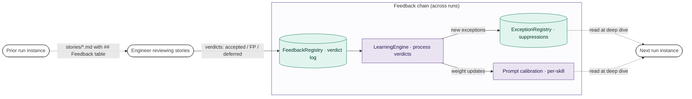

# autoresearch — architecture

A worked example of `explain_the_repo` applied to `~/Github/autoresearch`, a Python AI agent for cloud-cost optimization. Produced under the doc design pass with a 5-section plan and a 4-diagram architecture overview. This file is the full output the skill returns.

The user request: *"Explain the autoresearch repo — give me an architecture doc I can hand to a new engineer."*

---

# autoresearch — architecture

autoresearch is a Python AI agent that runs a 5-phase cloud-cost optimization pipeline. Each request walks a project's services through scripted discovery, LLM-driven deep-dive analysis, source-code grounding, JIRA story generation, and a hybrid programmatic-plus-LLM evaluation. The architecturally interesting property is the split between an in-process Python orchestrator and a sandboxed Copilot CLI subprocess that owns all LLM-driven reasoning — the orchestrator never calls an LLM API directly.

## Where to start reading

- **`cost_optimizer_agent.py`** — CLI entry point; `CostOptimizerAgent.run()` is the orchestrator's main loop. Start here to follow a single run end-to-end.
- **`pipeline.py`** — defines the FindingPipeline gates (`hypothesis → investigated → evidenced → story_ready`); read this before reading any of the per-phase modules.
- **`executors.py`** — wraps Copilot CLI invocations. Every LLM-driven step in any phase ultimately calls a function here.
- **`team_config.yaml`** — declares which services have orchestrated discovery scripts (vs single-call investigation). The orchestrated-vs-single-call decision in Phase 2 is driven by entries in this file.
- **`registries.py`** — defines `FindingRegistry`, `ExceptionRegistry`, `FeedbackRegistry`. State persisted across runs lives in their backing JSONL files; the structure of cross-run learning is best understood by reading these classes.
- **`cost_optimizer_agent.md`** (in the repo) — design intent doc the agent's authors wrote. Worth skimming for "why" questions; this architecture doc focuses on "what" and "how."

## Architecture overview

The system warrants a 4-diagram set rather than a single diagram. The diagram-set design pass produced:

- **[headline]** Request trace — one run end-to-end through the 5 phases with the intra-run refinement loop.
- **[zoom of headline's `p2` node]** Phase 2 deep dive — the orchestrated-vs-single-call dispatch.
- **[cadence sibling]** Cross-run feedback — runs across runs (days to weeks); user verdicts → LearningEngine → next-run calibration.
- **[topology sibling]** Persistent state map — what state persists between runs, scoped per-project / cross-project / per-run.

Aspects deliberately out of the diagram set, mentioned in NOTES on individual diagrams: dashboard event stream, hard failure paths, BehavioralVerdictSynthesizer, parallel specialist mode.

The diagram-set design pass returned `unanchored-zoom` once (the headline didn't explicitly name a `Phase 2 deep dive` node); fixed by relabeling `p2` before generation. All four diagrams shipped panel-clean afterward (syntax linter all clear, panel critiques returned ship across both parallel runs per diagram).

### Diagram 1 — Request trace

One run end-to-end. CLI invocation → preflight verify → service-mode bootstrap → Phase 2 deep dive (zoomed in Diagram 2) → Phase 3 source analysis → Phase 4 stories → Phase 5 evaluation → score → refinement decision → merge → return.

Concrete entry point: `cost_optimizer_agent.py --service "BigQuery,Dataflow" --project my-proj-prod --max-rounds 2 --budget 10`. Service mode, prior-run state in `FindingRegistry`.

Trust axis: ORCH (in-process Python) vs LLM (Copilot CLI subprocess, sandboxed). The split is the system's load-bearing design property — only the LLM-driven phases (`p3`, `p4`, `p5`) cross into the subprocess; the orchestrator and Phase 2 dispatch live in-process. The refinement loop is drawn as `refine{}` decision diamond with an explicit back-edge to `p2`.

### Diagram 2 — Phase 2 deep dive (zoom of `p2`)

Zooms the `p2` node from Diagram 1. Shows the orchestrated-vs-single-call dispatch within Phase 2.

Concrete entry point: a single Phase 2 invocation on `services = ["BigQuery", "Dataflow"]` arriving from `boot` or the refinement loop. BigQuery has a discovery script registered in `team_config.yaml`; Dataflow does not. The diagram traces both services through the dispatch.

The orchestrated branch costs $0 in scripted stages (`discover`, `triage`); only the per-entity specialist prompts hit the LLM. The single-call branch is one investigation prompt per service. This dispatch is the system's central efficiency move and is configured per-skill in `team_config.yaml`.

### Diagram 3 — Cross-run feedback loop (cadence sibling)

Different cadence: across runs, days to weeks. The slow loop that calibrates the agent over time.

Concrete entry point: a user reviewing `outputs/run-42/stories/*.md`. They edit each story's `## Feedback` table — verdicts like `accepted`, `false_positive`, `deferred` — and commit. LearningEngine processes the verdicts (typically batched), updates `ExceptionRegistry` (suppressions) and prompt-calibration weights, and the next run reads both at deep-dive time.

A second feedback channel — `BehavioralVerdictSynthesizer` — watches dashboard dismissals, stale findings, and cost snapshots, feeding the same `learning` step. Not drawn separately because it would be a 3-node sibling; mentioned here for completeness.

### Diagram 4 — Persistent state map (topology sibling)

Topology, not trace. Answers "what state persists between runs and who reads / writes it." Semantic axis is scope: per-project, cross-project, per-run.

The single `run` actor is a placeholder for any run instance touching these stores. Reads dotted, writes solid. The `FeedbackRegistry` write is human-mediated (the reviewing user, after the run completes); the run itself doesn't write verdicts.

## Component summaries

The orchestrator is split into discrete responsibilities. Each component is a class or module in the repo.

- **`CostOptimizerAgent` (`cost_optimizer_agent.py`).** The top-level orchestrator. Owns the run loop, dispatches between phases, applies the refinement decision. Does NOT itself invoke any LLM — all LLM work is delegated to `executors`. Read this to understand the run-level control flow.

- **`FindingPipeline` (`pipeline.py`).** State machine for findings. A finding moves through gates `hypothesis → investigated → evidenced → story_ready`; only `story_ready` findings reach Phase 4. Implements deduplication against `ExceptionRegistry` and threshold-based dropping. The pipeline is where business logic about "what counts as a real finding" lives.

- **`Executors` (`executors.py`).** Wrappers for Copilot CLI subprocess invocations. Every Phase 2 specialist call, Phase 3 source analysis, Phase 4 story generation, and Phase 5 evaluation routes through here. The `executors` module is the *only* place LLM calls happen — the trust boundary between in-process Python and the sandboxed subprocess is enforced by routing all reasoning through this module.

- **`Registries` (`registries.py`).** Persistent state. `FindingRegistry` (open findings, hash-chained for tamper-evidence), `ExceptionRegistry` (verdict-driven suppressions), `FeedbackRegistry` (verdict log). All three are JSONL-backed, per-project. Cross-run learning state lives in `LearningEngine` (separate module) and feeds back into `ExceptionRegistry` over time.

- **`Skills` (`skills/`).** Per-service discovery and triage scripts. `team_config.yaml` lists which services have skills; for each, the skills directory contains `discover.py` and `triage.py`. Services without skills fall through to single-call investigation. Adding a new orchestrated service is a matter of writing two short scripts and one config entry.

- **`Dashboard` (`dashboard/`).** A FastAPI sidecar that consumes the agent's event stream. Out of scope for this doc — see the dashboard's own README.

## Out of scope

- **Hard failure paths** (budget exhaustion abort, validation retry escalation with 3-attempt prompt rewrite). Documented inline in `cost_optimizer_agent.py` as `# FAILURE PATH:` comments; would warrant its own doc section if operations focus is needed.
- **Parallel specialist mode.** Concurrency variant of Diagram 2's `spec → spec_prompt` step that runs N specialists in parallel for high-entity-count services. See `cost_optimizer_agent.py:run_parallel_specialists()`.
- **Dashboard internals.** A separate FastAPI service with its own architecture; see `dashboard/README.md`.
- **Run-companion (`run_companion.py`).** Wrapper for cleanup and cleanup-time logging. Not part of the run-time architecture; see the script's docstring.
- **Eval suite (`tests/`).** Project-internal evaluation framework; see `tests/README.md` if any.

Generation notes

Doc plan: 5 sections (Headline, Where to start reading, Architecture overview, Component summaries, Out of scope). Doc-panel critique skipped (3 substantive sections + headline + out-of-scope wrapper; under the >3-sections threshold for doc-panel).

Architecture overview's diagram set: 4 diagrams (request trace headline + Phase 2 zoom + cross-run cadence sibling + state topology sibling). Diagram-set design panel revised one issue (`unanchored-zoom` on Diagram 2; fixed by labeling `p2[Phase 2 deep dive]` in the headline). All four diagrams shipped panel-clean across two parallel runs each. Syntax linter all clear on all four.

Per-section panels:
- Headline: prose, no panel (prose-only section).
- Where to start reading: prose with file pointers; not panel-reviewed (file pointers either resolve or don't).
- Architecture overview: 4-diagram set, panel-clean.
- Component summaries: prose grounded in named files; not panel-reviewed.
- Out of scope: prose, no panel.

Total subagent calls: 1 (diagram-set panel) + 8 (4 × 2 panel critiques) + 4 (4 × syntax linter) = 13 critique calls. Doc-level panel skipped per the 3-or-fewer-substantive-section rule.

