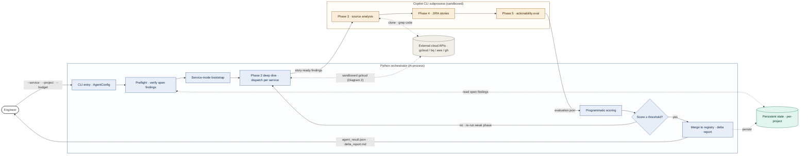
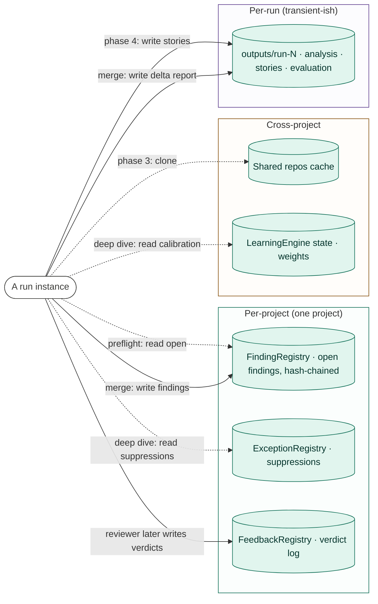

```mermaid
flowchart LR
  in([from boot / refine loop · Diagram 1])

  subgraph ORCH [" Python orchestrator (in-process) "]
    direction TB
    skills{Skill has<br/>discovery script?}
    discover[discover.py · scripted gcloud · $0]
    triage[triage.py · deterministic rules]
    spec[Per-entity specialist driver]
    single[Single-call investigation driver]
  end

  subgraph LLM [" Copilot CLI subprocess (sandboxed) "]
    direction TB
    spec_prompt[Per-entity prompt]
    single_prompt[Investigation prompt]
  end

  cloud[(gcloud / bq · sandboxed)]

  out([to FindingPipeline · Diagram 1])

  in --> skills
  skills -->|"yes · BigQuery"| discover
  discover -->|"inventory.json"| triage
  triage -->|"deep_dive_queue"| spec
  spec --> spec_prompt
  spec_prompt <-.->|"per-entity tools"| cloud
  spec_prompt -->|"specialist_*.json"| spec

  skills -->|"no · Dataflow"| single
  single --> single_prompt
  single_prompt <-.->|"investigation tools"| cloud
  single_prompt -->|"deep_dive.json"| single

  spec --> out
  single --> out

  classDef orch  fill:#E8EEF7,stroke:#1F4E8C,color:#0E2747
  classDef llm   fill:#FAEEDA,stroke:#854F0B,color:#412402
  classDef ext   fill:#F1EFE8,stroke:#5F5E5A,color:#2C2C2A
  classDef actor fill:#FFFFFF,stroke:#3d3d3a,color:#3d3d3a

  class skills,discover,triage,spec,single orch
  class spec_prompt,single_prompt llm
  class cloud ext
  class in,out actor

  style ORCH fill:#E8EEF722,stroke:#1F4E8C
  style LLM  fill:#FAEEDA22,stroke:#854F0B
```

# autoresearch — AI agent for cloud-cost optimization (multi-diagram set)

A worked example of the skill applied to a Python AI agent that runs a 5-phase cloud-cost optimization pipeline, orchestrates Copilot CLI subprocesses for the LLM-driven phases, and has both intra-run refinement and cross-run learning loops.

This is the **multi-diagram** version. An earlier single-diagram version of this example (preserved in git history at commit `89335a5`) ended up at 21 nodes — hard-fail noun-inventory band — because that's what the system honestly needs in one frame. The fix wasn't to consolidate; it was to recognize that the system warrants a *set* of diagrams. Step 0 of `SKILL.md` now decides set composition before any Mermaid is generated; this example shows what the multi-diagram output looks like end-to-end.

## Design summary

Four-diagram set covering the autoresearch system:

1. **[headline] Request trace** — one run end-to-end through the 5-phase pipeline with the intra-run refinement loop visible. The Phase 2 deep dive appears as a single node (`p2`) that diagram 2 zooms.
2. **[zoom of diagram 1's `p2` node] Phase 2 deep dive** — the orchestrated-vs-single-call dispatch, decision diamond → discover/triage/specialist on the orchestrated branch, single-call driver on the other.
3. **[cadence sibling to diagram 1] Cross-run feedback loop** — runs across runs (days to weeks). User verdicts on stories → FeedbackRegistry → LearningEngine → ExceptionRegistry / prompt calibration → next run's deep-dive prompts.
4. **[topology sibling] Persistent state map** — what state persists between runs and who reads / writes it. Per-project, cross-project, per-run scopes.

Aspects deliberately out of the set, mentioned in individual diagram NOTES rather than drawn:

- Dashboard event stream (every phase emits events; observability concern, sibling on its own).
- Hard failure paths (budget exhaustion abort, validation retry escalation) — would be a 5th sibling but doesn't earn it under the cap.
- BehavioralVerdictSynthesizer (passive watcher of dashboard dismissals / stale findings / cost snapshots) — folded into diagram 3's NOTES.
- Parallel specialist mode (concurrency variant of diagram 2) — folded into diagram 2's NOTES.

## Design-panel summary

Design-panel revised one issue: `unanchored-zoom` on diagram 2 — the initial set design described diagram 2 as zooming "Phase 2 deep dive" but didn't explicitly name a `Phase 2 deep dive` node in the headline scope. Fixed by renaming the headline's `p2` node to `p2[Phase 2 deep dive · dispatch per service]` so the zoom anchor is unambiguous.

---

## Diagram 1 — Request trace (headline)

### Plan

- **Concrete entry point.** `cost_optimizer_agent.py --service "BigQuery,Dataflow" --project my-proj-prod --max-rounds 2 --budget 10`. Service mode, prior-run state in `FindingRegistry`.
- **Ordered path.** CLI → preflight (verifies prior open findings against current state, scripted gcloud, $0) → service-mode bootstrap (skips Phase 1, synthesizes cost summary) → Phase 2 deep dive (one node here; zoomed in diagram 2) → Phase 3 source analysis → Phase 4 stories → Phase 5 evaluation → score → refinement decision → merge → return. Refinement loop edge: `refine -->|no| p2`.
- **Semantic axis.** Trust / execution boundary — Python orchestrator (in-process) vs Copilot CLI subprocess (sandboxed), with external cloud APIs and per-project persistent state as adjacent stores.
- **Out of scope** (covered by sibling diagrams or NOTES). Phase 2 internals (diagram 2). Cross-run feedback (diagram 3). Persistent state details (diagram 4 — shown here as a single cylinder). Dashboard internals. Hard failure paths.

### Mermaid source

### Notes

- **Phase 2 internals** are in diagram 2 — `p2[Phase 2 deep dive · dispatch per service]` is a single node here; the zoom diagram explodes it.
- **Cross-run feedback** is in diagram 3 (different cadence — across runs, days to weeks).
- **Persistent state landscape** is in diagram 4. This headline shows persistent state as one cylinder so the trust axis stays the focus.
- **Dashboard event stream** is intentionally out of scope; mentioned here only because every orchestrator phase emits events to it.
- **Architectural choices surfaced visually.** Refinement loop as `refine{}` decision diamond with explicit back-edge to `p2`. Trust crossing on the Phase 3-5 LLM phases (`<-->` to cloud labeled "sandboxed"). Service-mode bootstrap as its own node so the no-CSV path is visible.
- **Renderer config.** `flowchart LR`, elk renderer (`defaultRenderer: 'elk'`, `curve: 'basis'`, `nodeSpacing: 50`, `rankSpacing: 60`).

### Panel summary

Panel clean on structure (return arrow exists, single sync cadence, no out-of-scope sprawl, trust-axis honest with ORCH and LLM cleanly separated). One borderline issue surfaced: `noun-inventory` at 13 nodes (soft band — driven by the load-bearing 5-phase split and the refinement loop's decision diamond; consolidating would bury the architectural choices the design pass already split out into siblings).

---

## Diagram 2 — Phase 2 deep dive (zoom)

### Plan

- **Zooms** diagram 1's `p2` node.
- **Concrete entry point.** A single Phase 2 deep dive on `services = ["BigQuery", "Dataflow"]` arriving from `boot` or from the refinement loop. BigQuery has a discovery script registered in `team_config.yaml`; Dataflow does not. The diagram traces both services through the dispatch.
- **Ordered path.** Entry → `skills{Skill has discovery script?}` → orchestrated branch (`discover.py` runs scripted gcloud, $0; `triage.py` applies deterministic rules; `spec` driver invokes per-entity Copilot CLI prompts) OR single-call branch (`single` driver invokes one Copilot CLI investigation prompt). Both branches converge to `out → FindingPipeline` (back to diagram 1).
- **Semantic axis.** Same trust / execution axis as the headline — Python orchestrator (the drivers and scripted scanners are in-process) vs Copilot CLI subprocess (the LLM-driven investigation prompts).
- **Out of scope** (mentioned in NOTES). Parallel specialist mode (concurrency variant of `spec`). Cost capping logic. Specialist tool invocations beyond gcloud.

### Mermaid source

### Notes

- **Anchored to diagram 1** via the `p2` node — the `in` and `out` actors at the boundary represent the entry from `boot` / refine-loop and the exit back to the FindingPipeline that diagram 1 shows in full.
- **The `discover.py` / `triage.py` stages cost $0** — scripted gcloud calls and deterministic rules. Only the per-entity / single-call investigation prompts hit the LLM. This is the architectural efficiency the dispatch is designed around.
- **Trust crossing.** The `spec` and `single` drivers live in ORCH (Python). They invoke Copilot CLI as subprocesses; the LLM-driven prompts (`spec_prompt`, `single_prompt`) are conceptually inside the subprocess. The `<-->` edges labeled "per-entity tools" / "investigation tools" make the subprocess crossing visible.
- **Out of scope.** Parallel specialist mode runs N specialists concurrently for high-entity-count services; would be a sibling that splits this `spec → spec_prompt` step into a fan-out. Not drawn here.
- **Renderer config.** `flowchart LR`, elk renderer. Standard config.

### Panel summary

Panel clean. Trace closes on both branches (back to FindingPipeline via `out`); decision diamond is the architectural choice drawn structurally; trust axis aligned with the headline. No borderline issues at 9 nodes.

---

## Diagram 3 — Cross-run feedback loop (cadence sibling)

### Plan

- **Cadence.** Across runs — typically days to weeks between cycles. This is the slow loop that calibrates the agent over time.
- **Concrete entry point.** A user reviewing `outputs/run-42/stories/*.md` files at the end of a run. Each story has a `## Feedback` table with rows like `Verdict: accepted | false_positive | deferred`. The user fills 3 verdicts (2 accepted, 1 FP).
- **Ordered path.** Prior run produces stories → user marks verdicts → FeedbackRegistry records the verdict log → LearningEngine processes (typically batched) → ExceptionRegistry gets new suppressions, prompt calibration weights update → next run reads both at deep-dive time.
- **Semantic axis.** Cadence boundary — within-run reads/writes are dotted (the prior run wrote stories; the next run reads calibration); the across-runs human-driven chain is solid.
- **Out of scope** (NOTES). The in-run flow itself (diagram 1). BehavioralVerdictSynthesizer (passive watcher; mentioned in NOTES below).

### Mermaid source

### Notes

- **Cadence sibling to diagram 1.** Diagram 1 is one run; this diagram spans across runs. The dotted edges at the boundary represent within-run reads/writes the run instance does at its respective phases.
- **BehavioralVerdictSynthesizer.** A parallel feedback channel runs independently of explicit user verdicts — it watches dashboard dismissals (user closing finding cards), stale findings (no action after N runs), and cost snapshots that confirm or refute predicted savings. Its outputs feed the same `learning` step. Not drawn separately because at 3 nodes it would belong in NOTES under the design-pass rules; mentioned here for completeness.
- **Architectural choices surfaced visually.** The split between human-marked verdicts (solid chain through FeedbackRegistry → LearningEngine) and the behavioral / passive channel (NOTES) is deliberate — the explicit verdict path is the contract; the behavioral channel is best-effort.
- **Renderer config.** `flowchart LR`, elk renderer. Standard config.

### Panel summary

Panel clean. Cadence is named explicitly in the plan and visible in the diagram via the actor split (prior_run / user / next_run); no in-run flow leaked into this frame; FeedbackRegistry and ExceptionRegistry as cylinders correctly distinguish stores from processing nodes. No borderline issues at 7 nodes.

---

## Diagram 4 — Persistent state map (topology sibling)

### Plan

- **Archetype.** Topology, not a trace. Answers "what state persists between runs and who reads / writes it." A run instance is the actor; the stores are the components.
- **Representative element.** The set of stores a run touches at preflight (read) and merge (write) time — and in between for source-analysis (clone), deep-dive (read calibration / suppressions), and story-output (write stories, append delta report).
- **Semantic axis.** Scope — per-project (FindingRegistry, ExceptionRegistry, FeedbackRegistry) vs cross-project (shared repos cache, LearningEngine state) vs per-run (outputs/run-N).
- **Out of scope.** In-memory state during a run. Lock files / coordination primitives. The dashboard event stream (different concern: ephemeral observability, not persistent state).

### Mermaid source

### Notes

- **Topology, not trace.** The `run` actor is a placeholder for any run instance touching these stores. There's no implied request flow — this diagram is the static state landscape that diagrams 1 and 3 reference.
- **Reads dotted, writes solid.** The convention here matches the headline's side-channel reads.
- **LearningEngine state is shown here as a store.** The processing that updates it (verdict-driven) is in diagram 3.
- **FeedbackRegistry write is human-mediated.** The run itself doesn't write verdicts; the reviewing user does, after the run completes. Captured as the long edge at the bottom.
- **Renderer config.** `flowchart LR`, elk renderer. Standard config.

### Panel summary

Panel clean. Topology archetype correctly named in the plan; storage components drawn as cylinders; per-project / cross-project / per-run scope axis visible in the three subgraphs. No borderline issues at 7 nodes.

---

## Set-level closing notes

Aspects flagged as out-of-set candidates the user could ask for as follow-up diagrams:

- **Hard failure paths** (budget exhaustion abort, validation retry escalation) — would be a fifth sibling, archetype "failure / recovery." The 3-attempt retry escalation in particular is structurally distinct from the refinement loop in diagram 1.
- **Dashboard observability** — every orchestrator phase emits events to a dashboard sidecar. A separate observability diagram could be drawn if the dashboard's behavior is the subject.
- **Parallel specialist mode** — concurrency variant of the orchestrated `spec → spec_prompt` step in diagram 2. Mentioned in diagram 2 NOTES; would warrant its own sibling if the user is investigating concurrency.

Each of these earns its own diagram only if the user is asking specifically about that aspect; the four-diagram set covers the load-bearing structure for the typical "how does this system work" request.
