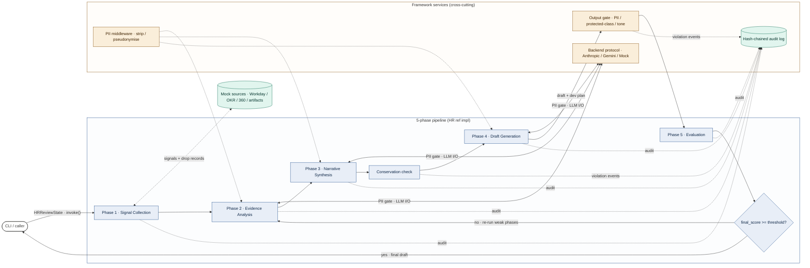
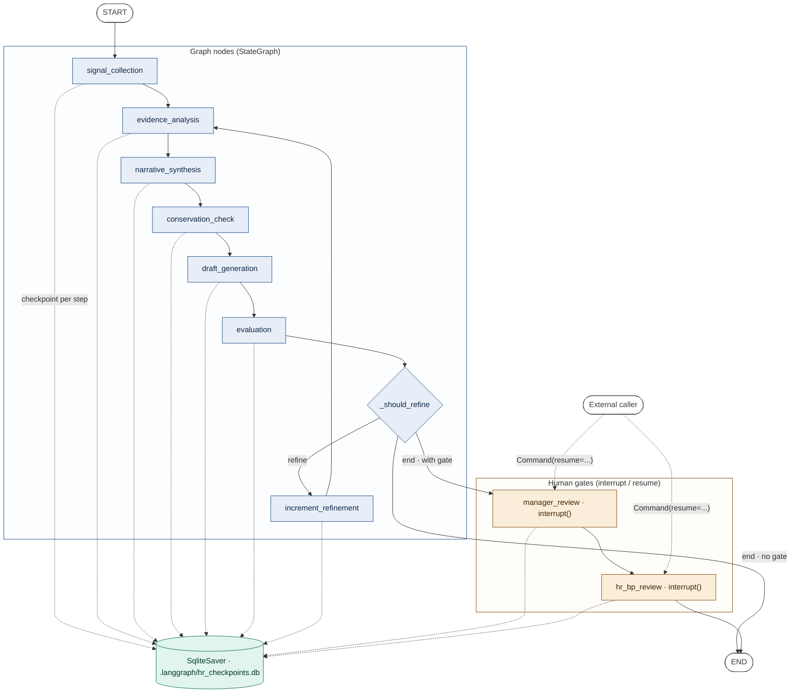
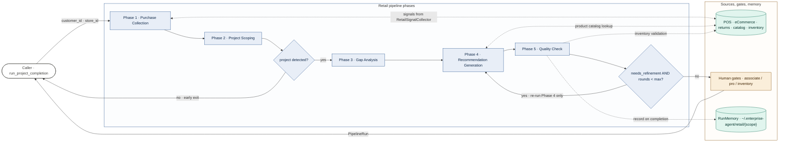
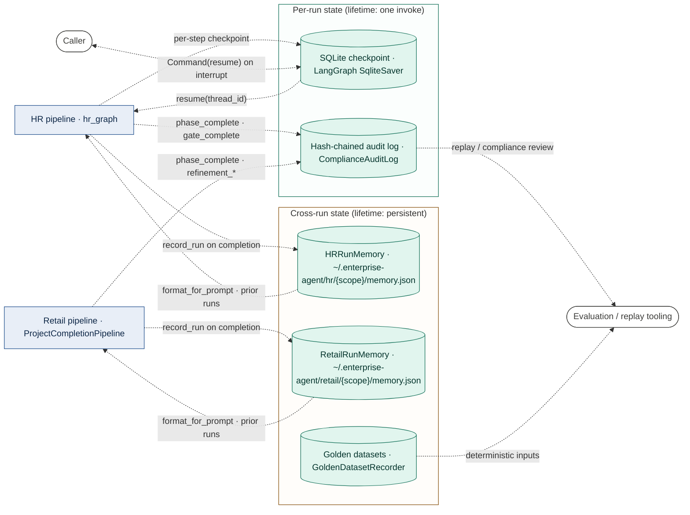

# enterprise-agents — architecture

`enterprise-agents` is a Python framework for building production agentic workflows around the **agentic-workflow pattern**: the developer fixes a phase sequence, the LLM has autonomy only within a phase. Two reference implementations ship in-tree — an HR performance-review pipeline orchestrated through LangGraph (`enterprise/hr_graph/`) and a retail project-completion recommender orchestrated through a hand-rolled Python loop (`enterprise/retail/pipeline.py`) — both built on a shared 5-phase shape with cross-cutting framework services (PII stripping, output guardrails, hash-chained audit, human gates, conservation checks, hybrid evaluation, cross-run learning). The architecturally interesting property is that the same 5-phase shape is realised twice with structurally different orchestrators, demonstrating what the framework provides versus what each domain reuses.

## Where to start reading

- **`enterprise/__init__.py`** — the public surface. Read once to see what the framework exports: `Backend`, `PipelineRun`, `HumanGate`, `ObservabilityStack`, `create_hr_review_app`, `ProjectCompletionPipeline`, `RunMemory`. Every concept in this doc has a symbol here.
- **`enterprise/models.py`** — the framework's foundational types: the `Backend` Protocol (`models.py:91`), `BackendResult`, `PhaseResult`/`PhaseStatus`, `EvaluationResult`/`MetricScore`, `DropRecord`, `HumanGate`/`GateStatus`, `PipelineRun`. Read this before the per-phase code.
- **`enterprise/hr_graph/factory.py`** — `create_hr_review_app(...)` is the top-level entry point for the HR reference implementation. Read this to follow how a provider string ("anthropic", "gemini", "mock") becomes a compiled LangGraph app with optional human gates and a SQLite checkpointer.
- **`enterprise/hr_graph/graph.py`** — the actual `StateGraph` wiring, including the `_should_refine` conditional edge and the `manager_review → hr_bp_review` gate insertion (`graph.py:178`).
- **`enterprise/retail/pipeline.py`** — the retail reference implementation in one file. `ProjectCompletionPipeline.run()` (`pipeline.py:1001`) is the orchestrator; the five `Phase{1..5}*` classes are right above it. Read this to see the same 5-phase pattern realised without LangGraph.
- **`enterprise/README.md`** — install, Docker, CLI, integration-point table. Complementary to this doc; covers the "how do I run it" surface.
- **`enterprise/hr_graph/README.md`** — graph shape, state contract, gate protocol, observability hooks. The most useful single file for understanding the HR orchestrator.

## Architecture overview

The framework's structural shape is a **3-diagram set**: a headline trace anchored on the HR reference implementation that surfaces the cross-cutting framework services, plus two orchestration siblings that show how HR (LangGraph + interrupts + SQLite checkpoint) and retail (a Python `while` loop) implement the same 5-phase shape with different mechanics. The two reference implementations sharing a phase-shape but not an orchestrator is the load-bearing comparison; siblings make that explicit without sprawl in the headline.

Aspects deliberately out of the diagram set (covered elsewhere or in `Out of scope`): cross-run RunMemory + golden-dataset replay (see § Cross-run learning and persistence), multi-provider LLM fallback internals (see § Framework components), Slack / Teams notification fan-out (cross-cutting; lives on edge labels and in `human_gates.py`).

The diagram-set design pass returned **N=3, archetypes: trace + topology + topology** (the two orchestrator diagrams are topology, not request traces). Set-level critique was self-graded for this validation run — flagged a potential `unanchored-zoom` risk on Diagram 2 → addressed by anchoring Diagram 2 explicitly to the HR pipeline node group from Diagram 1's `PIPE` subgraph. All three diagrams: syntax linter ran for real on each, all `all_clear: true` after one auto-fix on Diagram 3 (unquoted `<scope>` token inside a cylinder label).

### Diagram 1 — The 5-phase shape with framework cross-cutters (HR trace as anchor)

One run end-to-end: a caller invokes the compiled HR LangGraph app with an `HRReviewState`, the pipeline collects signals, walks Phase 2–4 with the LLM (each call wrapped by a PII gate and audited), runs a conservation check between narrative and draft, evaluates the draft, and either loops back through weak phases or returns the final draft.

Concrete entry point: `create_hr_review_app(provider="mock", use_llm=False).invoke(HRReviewState(employee_id="emp-001", review_cycle="2026-Q1", manager_id="mgr-100", start_date=..., end_date=...))` (`enterprise/hr_graph/factory.py:33`, `README.md:75`). Heuristic mode, no API keys. Trust axis: framework cross-cutters (orange) vs pipeline phases (blue) vs storage (green).

Notes on what's structural here:

- **The conservation check sits between Phase 3 and Phase 4.** It's not a "phase" in the numbered sense — it's an invariant on every-input-maps-to-an-output, run as its own graph node (`hr_graph/nodes.py:112`, `make_conservation_check_node`). Surfacing it explicitly separates "the LLM produced narratives" from "we verified the rubric is fully covered."
- **PII as a gate on edges, not a peer node.** The `pii` box is the source of redaction policy; the labelled `PII gate · LLM I/O` edges between Phases 2/3/4 and the `Backend` are where stripping actually happens (`middleware/pii.py`, `PIIStrippingMiddleware`). Drawing PII as a peer would have created false call relationships.
- **The Backend Protocol as a single visible node** rather than three separate provider boxes — the framework's design property is that Anthropic, Gemini, and the mock are interchangeable behind the `Backend` Protocol (`models.py:91`).
- **The refinement back-edge** goes from `refine` to `p2` (evidence analysis). HR's refinement loop re-runs from the earliest phase any weak metric maps to (`hr_graph/graph.py:64`, `_should_refine`); for the canonical weak-metric set that's Phase 2.
- **Audit as a single sink** with multiple dotted incoming arrows — every phase, conservation, and the output gate write `phase_complete:*` / `violation events` to the same hash-chained store. Drawn as one node with seven inputs rather than seven separate writes.

Out of frame for Diagram 1: human gates (their state machine and pause/resume protocol are Diagram 2), the LangGraph machinery itself (Diagram 2), retail's orchestrator (Diagram 3), multi-provider fallback wiring (`enterprise/llm_backends.py`).

### Diagram 2 — HR orchestration: LangGraph topology + interrupt-based gates

Same pipeline, zoomed into the orchestrator. This diagram answers "what does LangGraph give us that the retail orchestrator does differently?" — three things: a conditional refinement edge, `interrupt()`-based human gates that genuinely pause the run, and a SQLite checkpointer that persists state per-step so a paused run can be resumed across processes.

Topology view, not a trace. Entry point: `build_hr_graph(use_llm=True, require_human_gate=True)` (`enterprise/hr_graph/graph.py:112`). This is the structural zoom of the `PIPE` subgraph in Diagram 1. The 5-phase ordering matches `signal_collection → evidence_analysis → narrative_synthesis → conservation_check → draft_generation → evaluation`; the gates appear only when the caller passes `require_human_gate=True`.

What this diagram is making visible:

- **The conditional edge** — `cond{"_should_refine"}` is `add_conditional_edges("evaluation", _should_refine, {"refine": ..., "end": post_evaluation_target})` (`graph.py:190`). Two outgoing edges from one decision node, which is what the refinement loop is structurally.
- **The `increment_refinement` node** is a dedicated state-update node, not inlined into evaluation, so the counter only advances when the refine edge actually fires (`graph.py:80`, `_make_increment_refinement_node`).
- **Gates are real `interrupt()` calls.** Each gate node calls `langgraph.types.interrupt({...})` and the run stops; the caller resumes with `Command(resume={"action": "approve"|"reject"|"request_revision", ...})` (`hr_graph/nodes.py:177`, `_make_gate_node`). The dotted arrow from `caller` to each gate represents the resume call, not a request.
- **The SQLite checkpointer is required infrastructure** — without `SqliteSaver` (`graph.py:106`, `_build_checkpointer`), `interrupt()` couldn't restore state on resume. It's not just an observability nice-to-have.
- **`require_human_gate=False` is the default.** Tests and CI runs skip the gates entirely; the `cond` decision routes straight to `END` (`graph.py:178`). This is why the gate subgraph is drawn as a separate compartment — it's optional infrastructure.

### Diagram 3 — Retail orchestration: a Python `while` loop with a different refinement target

Same 5-phase shape, hand-rolled orchestrator. The interesting difference from HR isn't just "no LangGraph" — it's that retail re-runs only Phase 4 (recommendation generation) on refinement, not the earliest weak phase. Project detection (Phase 2) and gap analysis (Phase 3) are deterministic from the inputs, so re-running them is wasted work; only the LLM-generated recommendations need iteration.

Concrete entry point: `ProjectCompletionPipeline(config=PipelineConfig(...)).run(customer_id="cust-123", store_id="store-456")` (`enterprise/retail/pipeline.py:953`, `ProjectCompletionPipeline.run`). Trust axis: retail pipeline phases (blue) vs gates/sources (orange) vs persistence (green). Same colour palette as Diagram 1, intentionally — the framework cross-cutters are the same colour family across implementations.

Three structural choices to notice:

- **Two decision diamonds, not one.** Project-detection has a structural early exit (`detected{"project detected?"}` → `no · early exit`): if Phase 2 doesn't recognise a project from the purchase signals, there's nothing for Phase 3+ to do, so the pipeline returns the partial `PipelineRun` and skips refinement entirely (`pipeline.py:1047`, `if scoping_output.primary_project is None`). The refinement guard is the second diamond.
- **Refinement back-edges to Phase 4 only.** Compare with Diagram 2's `inc → ea` — HR loops back to evidence analysis (Phase 2). Retail loops back to recommendation generation (Phase 4) because conservation violations and completeness issues are addressed by re-generating recommendations, not by re-detecting the project (`pipeline.py:1085-1091`). Same shape, different load-bearing target.
- **Conservation isn't its own node.** It runs inside Phase 5's quality check (`retail/pipeline.py:867`, `Phase5QualityCheck.execute` calls `check_conservation`), unlike HR where it's a separate graph node. Both impls enforce the conservation invariant; they just place the check differently.
- **Human gates are post-pipeline metadata, not interrupts.** `create_gates_for_recommendations(...)` (`retail/human_gates.py`) appends `HumanGate` records to `run.human_gates` after the loop completes; the retail orchestrator doesn't pause execution. A consumer of `PipelineRun` decides what to do with pending gates. This is a real architectural difference from HR's `interrupt()`-based gates.

## Framework components

The framework is roughly nine components, each importable from `enterprise/__init__.py`. Read them in this order for an onboarding pass.

**Backend abstraction (`enterprise/models.py:91`, `enterprise/llm_backends.py`).** The `Backend` Protocol defines a single method, `invoke(prompt, system_prompt, temperature, max_tokens) -> BackendResult`. Three concrete implementations live in `llm_backends.py`: `AnthropicBackend` (Anthropic SDK), `GeminiBackend` (Google GenAI SDK), and `MultiBackend` (primary + fallback wrapping). The mock implementation (`AnthropicAPIBackend` in `models.py:114`) exists for tests. The HR orchestrator additionally exposes a fourth path via `LangChainBackendAdapter` (`hr_graph/adapter.py`), which wraps a LangChain `BaseChatModel` (`ChatAnthropic` / `ChatGoogleGenerativeAI`) so phases can call the same `Backend.invoke` interface while LangSmith picks up traces upstream. The factory function `create_backend(provider, model)` (`llm_backends.py`) is the recommended entry point; `create_multi_backend` adds fallback. Cost and token accounting are populated on every `BackendResult` so audit and observability can attribute cost per phase.

**Models and pipeline primitives (`enterprise/models.py`).** Defines `PipelineRun` (one end-to-end execution, with phase results, gates, errors, cost), `PhaseResult`, `PhaseStatus`, `EvaluationResult` (with `MetricScore`, `identify_weak_areas`, `weak_areas`, `re_run_phases`), `DropRecord` (the conservation-law receipt for excluded inputs), `HumanGate`/`GateStatus`, and helpers `run_with_timeout`, `run_with_escalating_retry`, `PhaseRetryConfig`. Both reference impls thread `PipelineRun` through their orchestrators; both serialise `EvaluationResult` to drive the refinement decision. This module is the framework's lingua franca.

**PII middleware (`enterprise/middleware/pii.py`).** `PIIStrippingMiddleware` runs before every LLM call. Three modes — strip (drop), pseudonymise (replace with token), bucket (range) — applied per-field via the `STRIP_FIELDS` / `PSEUDONYMIZE_FIELDS` / `BUCKET_FIELDS` constants. Reversible pseudonymisation lets the post-LLM output be restored if the caller needs the original IDs back. `enterprise/middleware/presidio.py` is an opt-in Presidio integration (production-grade NER) gated behind the `INSTALL_PRESIDIO=true` Docker build arg. The design intent is architectural enforcement: PII is stripped at infrastructure, not by individual phases (`middleware/pii.py:7-8`).

**Observability stack (`enterprise/observability.py`).** Five layers — LLM call tracing (Layer 1), structured phase logging (Layer 2), run logging (Layer 3), append-only hash-chained compliance audit (Layer 4), alerting (Layer 5). `ObservabilityStack(run_id=...)` is the per-run handle; `LangSmithTracer` and `LangfuseTracer` are upstream integrations (LangSmith is wired by default via `configure_langsmith()` in `hr_graph/observability.py`). The `audit(run_id, action, actor)` method is the cross-cutting hook — every HR graph node and every retail phase calls it to record `phase_complete:*`, `gate_complete:*`, `refinement_start:round_N`, `pipeline_error`. The hash chain is what makes the log tamper-evident; each entry's hash includes the previous entry's hash.

**Output guardrails (`enterprise/guardrails.py`).** `OutputGate` wraps generated drafts and inspects them for violations: PII leaks (`PII_IN_OUTPUT`), protected-class references (`PROTECTED_CHAR_REF`), unauthorised compensation recommendations, biased language, ungrounded claims. `EvaluationSeverity.CRITICAL` violations hard-stop the phase; `HIGH` violations flag for HR BP review without blocking. The guardrail layer is one step in the enforcement hierarchy — system prompt < output validation < tool registry < architecture (`guardrails.py:5-10`).

**Human gates (`enterprise/human_gates.py`).** The shared `HumanGate` dataclass (in `models.py`) plus the gate manager and notification channels. Gate types: `manager_review`, `hr_bp_review`, `calibration`, `final_approval`, `employee_ack`. Notification channels are pluggable: `MockNotificationChannel`, `SlackNotificationChannel`, `TeamsNotificationChannel`, `MultiChannelNotification`. The cryptographic-approval design property: the agent never possesses a human auth token, so an "approval" must be issued by an authenticated human session — architectural impossibility of the agent self-approving. HR realises gates as `interrupt()`-based pauses (`hr_graph/nodes.py:177`); retail realises them as post-pipeline metadata in `PipelineRun.human_gates` (`retail/human_gates.py`). The gate dataclass is the same in both impls; the orchestration around it differs.

**Conservation checking (`enterprise/evaluation/conservation.py`).** The conservation law: every input that goes into a phase must either appear in the output OR have a `DropRecord` explaining why. `ConservationChecker.check(...)` returns `ConservationCheckResult` with violations and a coverage ratio. HR uses `PipelineConservationChecker` (`evaluation/conservation.py:339`) to check competency / goal / feedback / development coverage as a dedicated graph node; retail uses `ProjectCompletionConservationChecker` (`retail/conservation.py`) inside Phase 5. Unwaived missing inputs raise `ConservationViolationError`.

**Hybrid evaluation (`enterprise/evaluation/evaluator.py`).** Objective metrics in Python (specificity, grounding, coverage, calibration, conservation); subjective metrics via LLM (actionability, tone/fairness, coherence). `HRReviewEvaluator` orchestrates both for HR; retail's Phase 5 calls a smaller subset (conservation + completeness + accuracy + actionability + availability). Each metric is normalised to 0–1; the framework default `quality_threshold` is `0.7` (`hr_graph/state.py:82`). The `LLMEvaluator` is currently mock for retail's accuracy/actionability scores (`retail/pipeline.py:906-909`, marked as TODO production wiring) but real for HR via `evaluator.py`.

**Cross-run learning (`enterprise/learning.py`).** `RunMemory` is the per-scope persistent memory: Level 1 tracks run history (final scores, refinement rounds, cost trends), Level 2 tracks open / resolved items across runs, Level 3 generates a prompt-context blob for the next run. Subclasses `HRRunMemory` (`scope` is employee_id) and `RetailRunMemory` (`scope` is customer_id). Storage is JSON on disk under `~/.enterprise-agent/<domain>/<scope>/memory.json`. Memory is enabled per call — pipelines that don't pass a `RunMemory` instance simply don't persist. This is what lets a follow-up run see "this employee was reviewed last quarter, here are the development goals from then" without round-tripping through a database.

**Skills registry (`enterprise/skills.py` + per-domain extensions).** `BaseSkillsRegistry` is the abstract domain-knowledge store. `HRSkillsRegistry` ships `review_best_practices` and `calibration_guidelines` as built-in dict-defined skills. `enterprise/retail/skills/__init__.py` ships YAML-defined project skills (`deck/`, `bathroom/`, `fence/`) — each is a directory with `skill.yaml` (typical items, common mistakes, code compliance, recommendation tips) and `requirements.md`. The registry is what feeds `format_for_prompt()` calls inside Phase 2 / Phase 4 prompts so the LLM has domain context.

**Other framework pieces, less load-bearing for an onboarding pass:** `enterprise/pricing.py` (token-cost calculation per provider), `enterprise/async_support.py` (coroutine helpers), `enterprise/evaluation/skill_health.py` (component-level evaluation that maps metric failures back to skills via `RETAIL_SKILL_PHASE_MAP` / `HR_SKILL_PHASE_MAP`), `enterprise/evaluation/replay.py` (golden-dataset record/replay for regression testing), `enterprise/evaluation/improver.py` (`SkillImprover` — proposes skill edits from quality failures). Read these only when you have a reason to.

## Cross-run learning and persistence

The framework distinguishes two persistence cadences: **per-run state** (lifetime: one `invoke()`, may pause / resume but ends with `END`) and **cross-run state** (lifetime: persistent, accumulated across many runs for the same scope). They live in different stores with different writers and readers.

The HR pipeline produces both: per-step LangGraph checkpoints in SQLite (so an interrupted run can be resumed), and append-only audit entries on every node. The retail pipeline writes audit but uses no checkpointer — its orchestrator runs to completion in one process. Both pipelines optionally record into a domain-specific `RunMemory` JSON file when the caller passes a `RunMemory` instance to the constructor.

What each store owns:

- **SQLite checkpoint (`ckpt`)** — `enterprise/hr_graph/graph.py:106`, `_build_checkpointer`. LangGraph writes state after every node executes. The `thread_id` (defaulting to `state.run_id`) is the lookup key for resume. This is what makes `interrupt()` work across process boundaries: the caller can come back hours later with a `Command(resume=...)` and pick up exactly where the previous invoke paused. Retail does not use this store — its orchestrator runs synchronously in one process.
- **Hash-chained audit (`audit`)** — `enterprise/observability.py`, `ComplianceAuditLog`. Append-only, PII-free, hash-chained. Each entry's `hash` includes the previous entry's `hash`, so any retroactive tampering with a record breaks the chain on every entry after it. Default retention is 7 years (`DEFAULT_RETENTION_DAYS = 2555`, `observability.py:50`) for employment-records compliance. Both pipelines write to this store on every phase boundary, every refinement-loop entry, every gate decision, every guardrail violation.
- **`HRRunMemory` / `RetailRunMemory` (`enterprise/learning.py`)** — JSON on disk per scope. `record_run(pipeline_run)` extracts a small history entry (date, status, final_score, refinement_rounds, total_tokens, total_cost_usd) and appends it to the scope's `runs` list. `format_for_prompt()` produces a human-readable summary the next run can paste into its system prompt. This is the "what did we say about this employee / customer last time" channel that closes the cross-run feedback loop.
- **Golden datasets (`enterprise/evaluation/replay.py`)** — `GoldenDatasetRecorder` snapshots a run's inputs and expected outputs so regression tests (`GoldenDatasetReplayer`) can re-run the same inputs after a code change and compare the new evaluation results against the recorded baseline. Used by the framework's evaluation tooling, not by callers running the pipeline normally.

The HR resume protocol is what actually exercises the per-run/cross-run distinction: `caller` reads an interrupt payload, makes a decision out-of-band (Slack message, Teams approval, web UI), then resumes via `app.invoke(Command(resume={...}), config={"configurable": {"thread_id": run_id}})`. The state machine for this lives in `hr_graph/nodes.py:159` (`_apply_gate_decision`) and `hr_graph/README.md` documents the resume payload shape.

## Glossary

- **Agentic workflow.** A pattern in which the developer fixes the sequence of phases and the LLM has autonomy only within a phase. Contrast with a "true agent" that picks its own next step from a tool registry. Both reference implementations follow this pattern; it's the framework's design centerpiece (`README.md:391-396`).
- **Phase.** A discrete step in an agentic workflow pipeline with a defined input, output, and side effects. `enterprise.models.PhaseResult` is the framework's per-phase record. Each reference impl has five phases.
- **Conservation law.** Every input must either appear in the output or have a `DropRecord` explaining why it was excluded. Enforced by `evaluation/conservation.py`; violations either hard-stop the run (CRITICAL) or flag for review.
- **Drop record.** A typed receipt for a conservation exclusion (`enterprise.models.DropRecord`). Instead of silently losing data, the framework records `input_id`, `input_type`, `reason`, `dropped_by_phase` so an auditor can answer "why didn't this signal show up in the review?"
- **Gate (human gate).** A point in the pipeline where a human must approve before the run continues. Cryptographically enforced — the agent never holds a human auth token. HR gates pause via `interrupt()`; retail gates are post-run metadata.
- **Refinement round.** One iteration of the outer loop that re-runs weak phases when the evaluation score is below threshold. `max_refinement_rounds` defaults to 3. HR loops back to evidence analysis; retail loops back to recommendation generation.
- **Quality threshold.** The score below which Phase 5 triggers refinement. HR uses 0.7 on a 0–1 scale (`hr_graph/state.py:82`); retail uses 3.5 on a 0–5 scale (`retail/pipeline.py:129`). The two scales coexist for legacy reasons — HR was migrated to 0–1 to align `MetricScore.normalized`; retail still uses 0–5 internally.
- **Skill.** A domain-knowledge file the LLM can be primed with. HR built-in skills are dict-defined in `enterprise/skills.py:HRSkillsRegistry`; retail skills are YAML directories under `enterprise/retail/skills/`.
- **Hybrid evaluation.** Combination of Python objective metrics (specificity, grounding, conservation, coverage) with LLM subjective metrics (actionability, tone, bias). The split is intentional: things measurable from the output text without judgment go to Python; things requiring judgment go to the LLM.
- **Run memory.** Per-scope persistent state across runs. Levels 1–3: history, item tracking, prompt context. Storage is JSON, scoped per employee (HR) or per customer (retail).
- **Signal.** A piece of evidence collected in Phase 1. HR signals come from Workday / OKR / 360 / artifacts (`hr/mock_sources.py`); retail signals are purchase events from POS / eCommerce / returns (`retail/mock_sources.py`).
- **Backend.** The `Protocol` for LLM invocation (`models.py:91`). `invoke(prompt, system_prompt, temperature, max_tokens) -> BackendResult` with token / cost / audit data. Concrete implementations: `AnthropicBackend`, `GeminiBackend`, `MultiBackend`, `LangChainBackendAdapter`.

## Out of scope

This doc focuses on the framework's structural shape and the two reference implementations as parallel demonstrations of it. Several adjacent surfaces are deliberately not covered here:

- **Install, Docker, CLI, environment variables.** See `enterprise/README.md` (especially "Quick Start", "Running with Docker", and the "Environment Variables" table). The repo's README is end-user-facing; this doc is for someone reading the source.
- **Original design rationale and ADR-style documents.** The repo's `enterprise/thoughts/` series (`00-enterprise-agent-design.md`, `06-hr-agent-architecture.md`, `07-observability-and-guardrails.md`) and the panel-discussion markdown files capture design intent and trade-off discussions. Read those for "why does the framework look like this" rather than "what does the framework look like."
- **Evaluation deep-dive: skill-health, replay, improver.** `enterprise/evaluation/skill_health.py`, `replay.py`, and `improver.py` form a separate evaluation layer that lets the team grade individual skills against golden datasets and propose edits. Treated here only at glossary depth — a separate doc would do them justice.
- **Experimental modules.** `enterprise/experimental/` and `enterprise/platform/` are mostly empty / placeholder packages; not part of the supported framework surface. TODO: confirm in `enterprise/experimental/__init__.py` and `enterprise/platform/__init__.py`.
- **Evaluation report and implementation status.** `EVALUATION_REPORT.md` and `IMPLEMENTATION_STATUS.md` track progress and milestones; useful as context but not architecture.
- **Tests.** `tests/` covers each milestone (`test_hr_graph_m{1..5}.py`, `test_enterprise_hr.py`, etc.). The test map in `enterprise/hr_graph/README.md` is the best index.

Generation notes

Doc plan: 7 sections — headline, where-to-start, architecture overview (3-diagram set), framework components (prose), cross-run learning and persistence (hybrid prose + 1 diagram), glossary, out-of-scope.

Doc-panel: self-graded for this validation run (panel was not spawned as a real subagent). Verdict: ship plan as-is; no missing-section / wrong-section-order / not-grounded-section flags.

Diagram-set design pass: N=3 for the architecture-overview section, archetypes [trace, topology, topology]. Set-level critique self-graded; one risk noted (`unanchored-zoom` for Diagram 2) and addressed by anchoring Diagram 2's node group to the `PIPE` subgraph from Diagram 1.

Per-diagram results:
- Diagram 1 (5-phase shape): self-graded panel verdict ship; syntax linter all_clear (no fixes).
- Diagram 2 (HR LangGraph topology): self-graded panel verdict ship; syntax linter all_clear (no fixes; used `end_node` ID to avoid the `end` reserved-keyword footgun).
- Diagram 3 (retail orchestrator): self-graded panel verdict ship; syntax linter ran with one auto-fix applied — a cylinder label `[(RunMemory · ~/.enterprise-agent/retail/<scope>)]` had unquoted `<>` which would break the v11 parser; rewrote as `[("RunMemory · ~/.enterprise-agent/retail/{scope}")]` (quoted, swapped angle-bracket placeholder for brace-style).
- Diagram 4 (cross-run state map, in section 5): self-graded panel verdict ship; syntax linter ran with one auto-fix applied — two cylinder labels with unquoted `{scope}` were quoted for v11 safety.

Syntax linter: all clear after auto-fixes on Diagrams 3 and 4. The linter was run for real (mechanical scan) on each diagram; the panel critiques were self-graded inline per the validation run's instructions.

Doc-level review (Phase C): self-graded. Cross-section coherence sanity check — all section pointers resolve to files cited elsewhere; the three diagrams and the persistence diagram share a colour palette by intent; refinement back-edges are consistent between Diagram 1 (HR loops to Phase 2), Diagram 2 (`inc → ea`), and Diagram 3 (retail loops to Phase 4) and the prose explicitly contrasts those targets. Glossary terms appear in context before their definition in every case checked. No revision-worthy issues surfaced.

