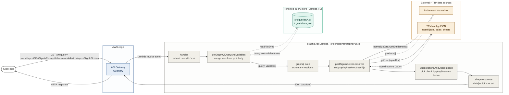

# graphql-node — architecture

A worked example of `explain_the_repo` applied to `~/Github/graphql-node`, an AWS Lambda + Serverless Framework project that exposes a Data Gateway HTTP API in front of an in-process GraphQL engine. Produced under the doc design pass with a 4-section plan and a single-diagram architecture overview.

The user request: *"Architecture overview of the graphql-node service — for handing to a new backend engineer."*

---

# graphql-node — architecture

graphql-node is an AWS Lambda + Serverless Framework service that fronts an in-process Apollo GraphQL engine with a `queryId`-based persisted-query interface. Clients call `GET /v0/query?queryId=...&device=...`, the gateway loads a persisted query template from disk by `queryId`, executes it against the schema, and resolvers fan out to upstream HTTP services (entitlement normalizer, TPM JSON config). The architecturally interesting property is the persisted-query store: queries are managed in source control rather than sent inline by clients, so the API's surface is the set of `queryId` values, not raw GraphQL.

## Where to start reading

- **`src/endpoints/graphqlApi.js`** — the gateway Lambda's handler. `handler()` is the entry point; read this first to follow the request flow.
- **`src/queries/`** — the persisted-query store. Each `<queryId>.txt` file is a GraphQL query; `<queryId>_variables.json` is its default variable set. Read a few to see what queries the gateway exposes.
- **`src/graphql/schema/`** — the merged Apollo schema. Read `index.js` for the merge order, then individual `*.graphql` files.
- **`src/graphql/resolver/upsell.js`** — canonical resolver pattern. Most other resolvers follow the same fan-out-to-dataSources shape.
- **`serverless.yml`** — Lambda configuration, route mapping, schedule triggers (e.g., the `appPromos` warm-up that fires every minute).
- **`README.md`** — the project's own README walks through the `postNBASignInRequest` example end-to-end; useful for "why was this built" context.

## Architecture overview

The system is a stateless request-response API with no separable cadences (no batch jobs, no cross-run feedback) and no load-bearing internal component complex enough to warrant a zoom sibling. The doc design pass concluded a single-diagram set is sufficient; the persistent-query store is small enough (one cylinder) to live inside the headline trace rather than getting its own topology sibling.

The diagram below traces a single happy-path request — `GET /v0/query?queryId=postNBASignInRequest&device=mobile&root=postSignInScreen` with `preAuthorizedEntitlements` in the body. This is the canonical "post sign-in" use case the README walks through and exercises the two-upstream-fan-out pattern (`entitlementNormalizer` + `tpm`) that resolvers are built around.

The semantic axis is deployment locality: AWS-edge (API Gateway) vs in-Lambda runtime vs Lambda's filesystem (the persisted-query store) vs external HTTP upstreams. There's no real trust boundary in the codebase (single AWS account, all upstreams via plain HTTPS), so the axis is "where does this run" rather than "what side of a security boundary."

## Component summaries

- **`graphqlApi` Lambda (`src/endpoints/graphqlApi.js`).** The gateway. `handler()` extracts `queryId` and optional `root` from the request, routes through `getGraphQlQueryAndVariables`, runs `graphql.exec`, then shapes the response. The `root` query-string trick (`?root=postSignInScreen`) returns `data[root]` instead of the full envelope — a deliberate design choice to let mobile clients ask for a specific top-level field without parsing GraphQL.

- **`getGraphQlQueryAndVariables` (`src/endpoints/graphqlApi.js`).** Reads `src/queries/<queryId>.txt` and `<queryId>_variables.json` from disk, then merges variables in this precedence: query string → body → file defaults. The merge order is load-bearing — query-string vars override body vars override defaults.

- **`upsell.js` resolver (`src/graphql/resolver/upsell.js`).** Canonical resolver. Fans out to two upstreams in parallel via `dataSources`: `entitlementNormalizer.normalize(preAuthEntitlements)` returns the user's product list; `tpm.getJson(upsellUrl)` returns TPM-managed JSON config with the upsell catalog. The field resolver `SubscriptionsAndUpsell.upsell` picks the upsell chunk by `(playStream, device)` and returns null if the user already has the product. Other queryIds (sales sheet, aggregator, etc.) follow the same fan-out shape with different upstreams.

- **DataSources (Apollo).** Not a single file — Apollo's `dataSources` mechanism. Each upstream is wrapped in a class that the resolver calls via `context.dataSources.<name>.<method>()`. Not drawn separately on the diagram; treat them as labeled edges from the resolver.

## Out of scope

- **Other queryIds.** `salesSheet`, the on-air aggregator, `vodEpisodes`, `appPromos`, NBA TV view, Content API. Same loader → graphql-exec → resolver → upstream-HTTP shape with different upstream sets. Not redrawn — one trace covers the pattern.
- **Standalone playground Lambda (`graphqlServer`).** A separate Apollo Server Lambda at `/graphql` for ad-hoc GraphQL queries; configured in `serverless.yml`. Not the gateway path the README describes.
- **`echo` and `mobileProduct` Lambdas.** Unrelated; configured in `serverless.yml`.
- **CodeBuild / CodePipeline (`buildspec.yml`, `deployspec.yml`).** Deploy-cadence concern, not a request trace. A separate doc could cover the build pipeline.
- **Scheduled warm-up event.** `serverless.yml` has a `rate(1 minute)` schedule firing the `appPromos` query to keep the Lambda warm. Different cadence; not a sibling diagram unless that warm-up is the subject.
- **Failure / caching paths.** The handler currently returns 500 with the raw error on upstream failure; no retry, no fallback caching. Worth documenting if operations focus is needed.

Generation notes

Doc plan: 4 sections (Headline, Where to start reading, Architecture overview, Component summaries, Out of scope = 5 with the wrapper). Doc-panel critique skipped (3 substantive sections under the >3 threshold).

Architecture overview's diagram: single-diagram set. Diagram-set design panel skipped (N=1). Per-diagram panel: cleaned the original `products[]` parse error during step-6 syntax-lint (label now quoted as `"products[]"`); panel critique returned ship across both parallel runs. Other revisions during earlier iterations: removed an out-of-scope `others` node (sibling-trace pointer; moved to NOTES) and surfaced the `data[root]` shape choice as its own node.

Per-section panels:
- Headline / Where to start reading / Component summaries / Out of scope: prose, no panel.
- Architecture overview: panel-clean diagram (post-revision).

Total subagent calls: 0 (diagram-set panel — N=1) + 2 (panel critique) + 1 (syntax linter) = 3 critique calls. Doc-level panel skipped per the 3-or-fewer-substantive-section rule.

