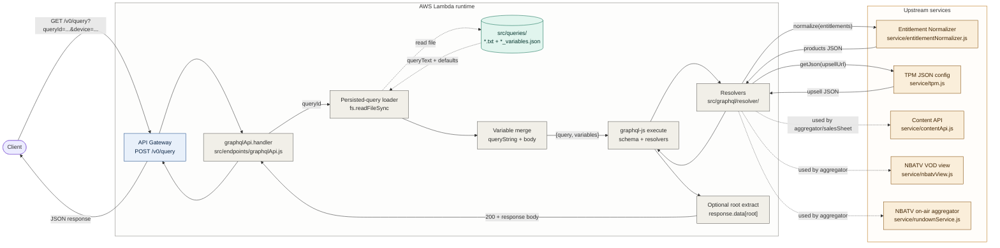
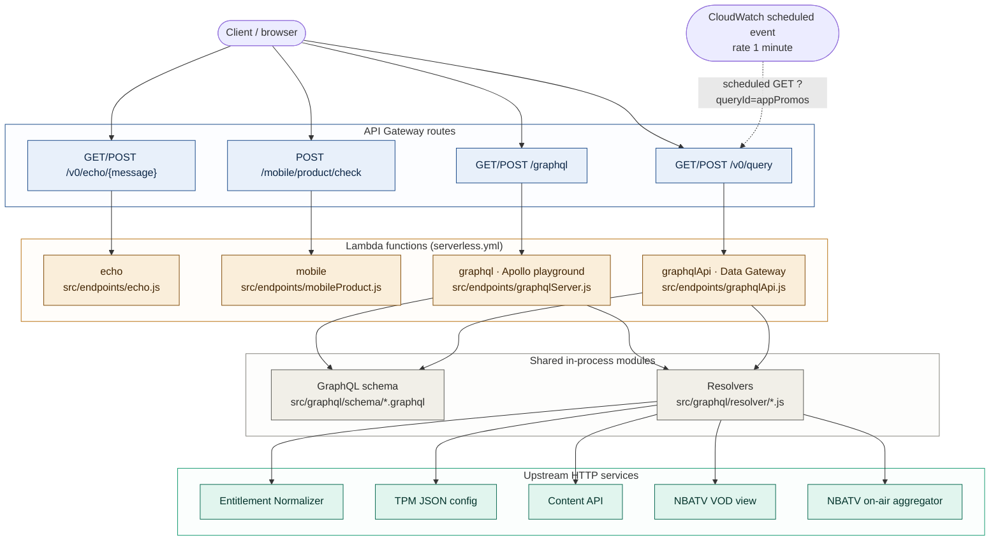
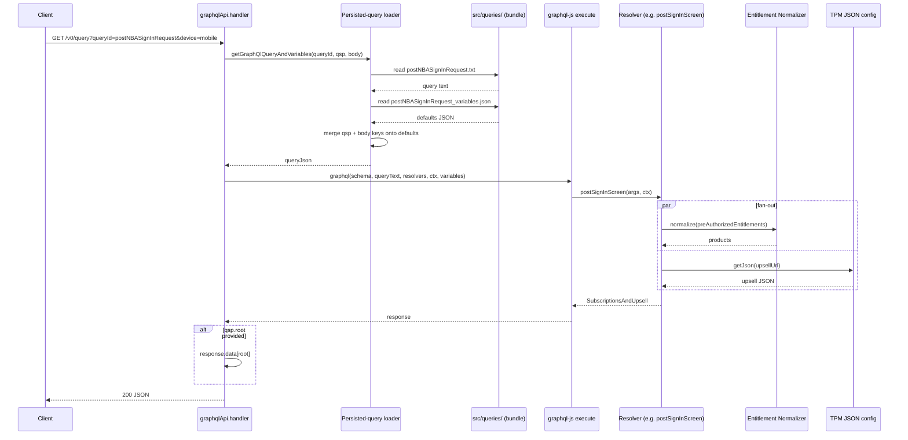

# graphql-node — architecture

A POC AWS Lambda + Serverless project that exposes a thin **Data Gateway** HTTP API in front of an **in-process GraphQL engine**. Clients never speak GraphQL directly: they pass a `queryId` (plus a few parameters) to `/v0/query`, and the gateway loads a persisted query from a file in the Lambda bundle, executes it locally with `graphql-js`, fans out to five upstream HTTP services through resolvers, and returns plain JSON. The architecturally interesting property is that the GraphQL query text and its variable defaults are **shipped in the repo as `.txt` + `.json` files** (`src/queries/`), not stored in a registry — so adding or editing a query is a code change, not a runtime operation.

## Where to start reading

- `serverless.yml` — the deployment manifest. Lists the four Lambda functions (`echo`, `mobile`, `graphql`, `graphqlApi`), their HTTP routes, and the scheduled CloudWatch event that warms `/v0/query` every minute.
- `src/endpoints/graphqlApi.js` — the **Data Gateway** handler. The single most explanatory file in the repo: persisted-query lookup, variable merging, in-process `graphql()` execution, optional response-rooting.
- `src/queries/` — the persisted queries themselves. Each query is a pair: `<id>.txt` (GraphQL query text) and `<id>_variables.json` (default variable values). Read `postNBASignInRequest.txt` + `postNBASignInRequest_variables.json` together to understand the contract.
- `src/graphql/schema/` — the GraphQL schema, split across nine `.graphql` files merged at module load via `merge-graphql-schemas` (see `graphqlApi.js:17-18`). Start with `query.graphql` for the entry-point Query type.
- `src/graphql/resolver/` — the five resolver modules (`upsell.js`, `salesSheet.js`, `appPromos.js`, `aggregator.js`, `nbatv.js`), merged at module load via `mergeResolvers` (`src/graphql/resolvers.js`). Each Query resolver maps 1:1 to one persisted-query use case.
- `src/service/` — the upstream-service wrappers (`entitlementNormalizer.js`, `tpm.js`, `contentApi.js`, `nbatvView.js`, `rundownService.js`). Each is a small `Create(host)` factory exposing one or two HTTP-fetching functions; resolvers consume them through the `dataSources` context.

## Architecture overview

The system has two complementary views worth seeing: the **request trace** through the Data Gateway, and the **deployment topology** that `serverless.yml` provisions.

### Request trace — `/v0/query`

The headline diagram follows a single concrete request — a client GET to `/v0/query?queryId=postNBASignInRequest&device=mobile` carrying `preAuthorizedEntitlements` in the body — from API Gateway to the upstream services and back. Color encodes the **trust / hosting boundary** (edge / Lambda runtime / external upstreams).

The two solid arrows out of `resolvers` (to `norm` and `tpm`) are the actual fan-out for the `postSignInScreen` query. The three dotted arrows to `cnt`, `vod`, and `rund` are upstreams used by *other* persisted queries (`aggregator`, `salesSheet`); they're shown so the reader can see the full set of upstreams the gateway can reach without having to draw five separate traces.

### Deployment topology — `serverless.yml`

The trace doesn't show what's actually deployed: there are **four** Lambda functions, not one. Two of them (`graphql` and `graphqlApi`) share the same in-process schema and resolvers. There is also a CloudWatch scheduled event that hits `/v0/query` every minute as a warmer.

Two notes on the topology:

- The `graphql` and `graphqlApi` Lambdas are **two deploy targets that share the same in-process module graph** at the source level. Each Lambda has its own cold start and its own copy of the schema/resolvers in memory; the "shared" subgraph is shared in the repo, not at runtime.
- The scheduled CloudWatch event (`serverless.yml:74-82`) calls `/v0/query?queryId=appPromos&device=mobile` every minute. This appears to be a Lambda-warmer / cache-priming pattern, though the codebase has no explicit caching layer to prime — `TODO: confirm intent of the rate(1 minute) schedule with the project owner`.

## Component summaries

### Data Gateway handler — `src/endpoints/graphqlApi.js`

The load-bearing component. ~100 lines that do four things, in order:

1. **Extract** `queryId` from path or query-string parameters (`extractParam` from `src/utils/lambdaHandlerUtil.js:16`).
2. **Load** the persisted query. `getGraphQlQueryAndVariables` (`graphqlApi.js:34`) reads `src/queries/<queryId>.txt` and `src/queries/<queryId>_variables.json` synchronously from the bundled Lambda filesystem and parses the JSON.
3. **Merge** runtime overrides onto the defaults: any key in `event.queryStringParameters` or in the parsed `event.body` whose name matches a default-variable key overwrites that default (`graphqlApi.js:44-57`). Body values are re-stringified before assignment, which matters for fields like `preAuthorizedEntitlements` whose schema type is `String` (a stringified JSON blob, not a typed object).
4. **Execute** by calling `graphql(schema, queryText, resolvers, serviceContext, variableValues)` from the `graphql` package directly — *not* through Apollo. `serviceContext` carries the five upstream-service instances under a `dataSources` key (`graphqlApi.js:69-78`).

After execution, if `event.queryStringParameters['root']` is set, the handler returns `response.data[root]` instead of the full GraphQL response envelope (`graphqlApi.js:96-100`). This is what lets the gateway return "what the client needs, not what GraphQL gives you" — a flat JSON shape rooted at the relevant data, with the GraphQL `{data: {...}}` wrapper stripped.

### Apollo playground handler — `src/endpoints/graphqlServer.js`

A separate Lambda exposing the GraphQL schema directly through `apollo-server-lambda`'s `createHandler()` at `/graphql` (GET + POST, CORS enabled). It uses the **same** `typeDefs`, `resolvers`, and upstream service instances as the Data Gateway (compare `graphqlServer.js:13-37` to `graphqlApi.js:17-31` — the setup is duplicated almost line-for-line). Its purpose is the playground / direct-GraphQL access for development; in production traffic, clients are expected to go through `/v0/query`.

### Persisted-query store — `src/queries/`

Eighteen files: nine query / variables pairs covering five logical queries (`postNBASignInRequest`, `salesSheet`, `salesSheet_cd`, `appPromos`, `aggregator`, plus `_cd` / `_mobile` / `Nobball` variants). The query text is verbatim GraphQL (e.g. `postNBASignInRequest.txt:1-9` is a multi-arg query); the variables file is a flat JSON object mapping each query variable name to its default value (e.g. `postNBASignInRequest_variables.json` defaults `device: "mobile"`, `preAuthorizedEntitlements: "[]"`, `upsellUrl: "sales_sheets/postNBASignIn.json"`).

The store is **read-only at runtime** — `fs.readFileSync` on every request, no cache. There is no S3 fetch, no hot reload, no admin endpoint to update queries. The README mentions storing queries in S3 with hot reload as a future direction (README "Quries" section), but the implemented version uses bundled files.

### Schema and resolver loaders — `src/graphql/`

The schema is assembled at module-init time by `fileLoader(path.join(__dirname, '../graphql/schema'))` + `mergeTypes(...)` (`graphqlApi.js:17-18`). The nine `.graphql` files cover: `query.graphql` (root Query type — five Query fields), `entitlement.graphql`, `salesSheet.graphql`, `appPromos.graphql`, `aggregator.graphql`, `nbatv.graphql`, `stream.graphql`, `team.graphql`, `common.graphql` (shared scalars and enums — `JSON`, `PlayStream`, `Device`, `LinkType`).

The resolvers are similarly assembled by `mergeResolvers(fileLoader('./resolver'))` (`src/graphql/resolvers.js:1-5`) across five files. Each Query resolver matches one entry point in `query.graphql`:

| Query field         | Resolver file                | Upstreams used                                    |
|---------------------|------------------------------|---------------------------------------------------|
| `postSignInScreen`  | `resolver/upsell.js:8`       | `normalizer`, `appConfigApi` (TPM)                |
| `salesSheetScreen`  | `resolver/salesSheet.js:8`   | `normalizer`, `appConfigApi` (TPM)                |
| `appPromos`         | `resolver/appPromos.js:7`    | `normalizer`, `appConfigApi` (TPM)                |
| `aggregator`        | `resolver/aggregator.js:8`   | `appConfigApi` (TPM); fans out to `contentApi`, `nbatvOnAirAggregator`, `nbatvVodView` via field resolvers |
| `vodEpisodes`       | `resolver/nbatv.js:9`        | `nbatvVodView`                                    |

The `aggregator` resolver is the most complex: its top-level call fetches a "skeleton" JSON from TPM, and field resolvers on `Aggregator.schedule`, `Aggregator.vodEpisodes`, and `ContentAPIResult.content` lazily fan out to additional upstreams only if those fields are selected. This is GraphQL's "what the client asks for is what you fetch" property doing real work.

### Upstream service wrappers — `src/service/`

Five small modules, each shaped the same way: a `Create(host[, path])` factory that closes over the host URL and returns an object exposing one or two HTTP-fetching functions (`getJson`, `normalize`, `getRundown`, `getPageByPath`, `getCollectionById`, `getVODEpisodesByRadiusCollectionId`). All HTTP work goes through either `src/utils/http.js` (a hand-rolled `https.get` Promise wrapper) or `mssUtils.HTTP` from the `mss-sead-js-utils` package. None of them implement caching, retries, circuit-breakers, or auth beyond a hardcoded `accessToken` string in `contentApi.js:10`.

The factory pattern is unusual: the host URL is captured in a *module-level* `var dataHost` (e.g. `tpm.js:4`, `nbatvView.js:4`), so calling `Create(...)` twice on the same module clobbers the previous host. In practice this isn't a problem because each service is `Create`d exactly once at module init in `graphqlApi.js:27-31` and `graphqlServer.js:23-27`.

## Data flow — query resolution inside one Lambda invocation

The most architecturally interesting part of this system is the moment between "API Gateway hands the event to the Lambda" and "the resolver starts an HTTP call." That window contains: persisted-query lookup, variable merging (with body values stringified), in-process `graphql()` invocation, and optional response-rooting. The diagram below traces a single invocation in time order. Read each step against `src/endpoints/graphqlApi.js` line-by-line.

Three details that aren't obvious from the diagram:

- **The variable-merge order matters.** `event.queryStringParameters` keys are written first, then `event.body` keys (`graphqlApi.js:44-57`); body wins for any key present in both. Both sources are filtered by `persistendQueryVariableJson.hasOwnProperty(key)`, so unknown keys are silently dropped — only the persisted query's declared variables can be overridden.
- **Body values are JSON-stringified back before assignment** (`graphqlApi.js:54`). This is why `preAuthorizedEntitlements` arrives as a stringified JSON array and the resolver re-parses it (`upsell.js:11`); the schema's `String` type is being used to smuggle structured data through, with both encode/decode hops explicit.
- **The fan-out is parallel.** `upsell.js:15-26` kicks off both `appConfigApi.getJson(...)` and `normalizer.normalize(...)` before any `await`, then awaits each promise. The `salesSheet.js` and `appPromos.js` resolvers do the same thing. There is no `mssUtils.PROMISE_UTILS.execAll` call in the current resolvers (the README's example is outdated).

## Out of scope

This doc is the system explanation, not a deployment runbook or an upstream-services reference.

- **Deployment pipeline.** `buildspec.yml` and `deployspec.yml` are the AWS CodePipeline build/deploy specs; the README points at a separate CloudFormation repo (`[org]-node-app-pipeline-nonprod-stack`) for the pipeline itself. Read `serverless.yml` for the runtime infra and the README's "Deploy to AWS" section for the pipeline pointer.
- **Demo handlers.** `src/endpoints/echo.js` and `src/endpoints/mobileProduct.js` are stand-alone demo endpoints unrelated to the GraphQL gateway. `src/tools/` contains support scripts (e.g. `daltonMobileProductsClient` referenced by `mobileProduct.js`) that aren't part of the gateway path.
- **Upstream service internals.** The five HTTP services this gateway calls (entitlement normalizer, TPM config, content API, NBATV VOD view, NBATV on-air aggregator) are external systems with their own repos and contracts; this doc treats them as opaque HTTP endpoints.
- **Failure modes.** Each resolver's error handling is a try/catch that returns the error object as the resolved value (e.g. `entitlementNormalizer.js:21-24`); `graphqlApi.js:103` catches at the handler level and returns 500. There is no retry, circuit-breaker, or partial-result reconciliation. Document those if you adopt this pattern in production.

Generation notes

Doc plan: 6 sections — headline, where-to-start, architecture-overview (diagram-set N=2), component-summaries, data-flow (hybrid, N=1 sequence diagram), out-of-scope. Sections deliberately omitted: state-and-persistence (no app-owned store), lifecycle (no offline/online split), failure-modes (not requested, codebase has only minimal try/catch handling), glossary (light domain language).

Doc-panel (Phase A, plan review): self-graded ship — section coverage matches the system's load-bearing aspects, where-to-start is present, out-of-scope is present and explicit about omissions, order is canonical.

Diagram-set design pass for architecture-overview: N=2. Headline trace + topology sibling. Set-panel (self-graded): ship — topology answers "what's deployed" which the trace cannot, scheduled-event warmer is otherwise invisible.

Per-diagram panels (self-graded for this validation run):
- Diagram 1 (request trace, archetype `request-trace-no-trust-bounds`): ship. 13 nodes. Three-group axis (edge / Lambda runtime / external) is consistent. Trace closes back to client. Dotted arrows distinguish "used by other queries" upstreams from the active fan-out.
- Diagram 2 (deployment topology, archetype `request-trace-no-trust-bounds` borderline `topology`): ship. 16 nodes (under hard ceiling). Subgraph axis matches deployment surface. CloudWatch scheduled event drawn as separate dotted external trigger.
- Data-flow diagram (sequenceDiagram): ship. Right Mermaid sublanguage for time-ordered call sequence. Grounded in `graphqlApi.js:34-67` and `upsell.js:8-33`.

Syntax linter: all clear across all three diagrams. All edge labels containing `?`, `=`, `&`, `(`, `)`, `{`, `}`, `+` were quoted preemptively per `mermaid-patterns.md` footgun checklist.

Doc-panel (Phase C, assembled-doc review): self-graded ship — sections agree internally (the prose claim that fan-out is parallel matches the diagram's `par/and` block; the topology claim of two source-shared Lambdas matches the diagram's two arrows from each handler into shared modules). Pointers in where-to-start resolve to real files. No dangling references. One open question marked `TODO: confirm` (intent of the 1-minute scheduled event). Self-graded for validation run.

