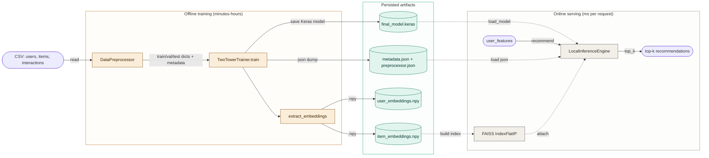
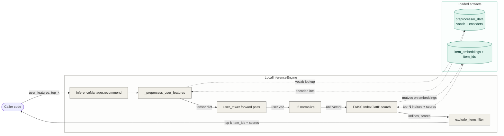
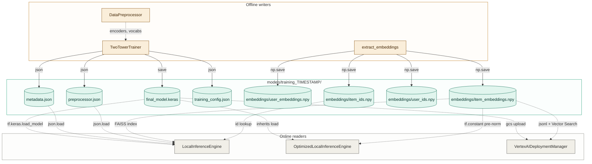

# recs_two_tower — architecture

A Keras-based two-tower recommender for home-improvement products: separate user and item neural networks project features into a shared embedding space, item embeddings are precomputed offline, and online serving reduces to "encode the user, top-k against a prebuilt index." The system is structured as two independent halves — an **offline trainer** (`src/training.py`, `src/optimized_training.py`) that produces a saved Keras model plus `.npy` embedding files, and an **online server** (`src/inference.py`, `src/optimized_inference.py`, `src/vertex_ai_utils.py`) that loads those artifacts and serves recommendations from FAISS locally or Vertex AI Vector Search in production. The artifact directory is the *only* coupling between the two halves.

## Where to start reading

- `src/model.py` — the whole model in one file: `UserTower`, `ItemTower`, and `TwoTowerModel` (which composes them and computes the dot-product loss). Read this first.
- `src/training.py` — `TwoTowerTrainer.train` is the offline entry point; `extract_embeddings` is what writes the `.npy` files that the serving side will later mmap.
- `src/inference.py` — `LocalInferenceEngine.recommend_items` is the online entry point; the FAISS index is built once at engine init.
- `src/optimized_inference.py` — `OptimizedLocalInferenceEngine` replaces FAISS with a `@tf.function`-compiled similarity search backed by `tf.constant` pre-normalized embeddings. Useful to read after `inference.py` to see the production optimizations.
- `src/vertex_ai_utils.py` — `VertexAIDeploymentManager.full_deployment_pipeline` is the end-to-end GCP deployment recipe: GCS upload, user-tower endpoint, Vector Search index plus endpoint.
- `run_demo.py` — top-level "generate synthetic data, train, recommend" script. The shortest path to seeing the system run end to end.

## Architecture overview

The system has two cadences: an offline training cadence (minutes-to-hours; produces artifacts) and an online serving cadence (per-request milliseconds; consumes artifacts). The diagrams below split along that boundary.

### Diagram 1 — Lifecycle: offline training produces artifacts that online serving consumes

The offline side reads CSVs, fits encoders and the model, then dumps four kinds of artifact: the saved Keras model, JSON metadata + preprocessor state, and `.npy` arrays for user/item embeddings and ids. The online side loads those artifacts and answers `recommend(user_features, top_k)` requests.

The architectural choice surfaced visually: **the artifact store is the only coupling between offline and online**. Either half can be redeployed independently as long as the artifact contract holds. Source: `src/training.py:194-237` (saving), `src/inference.py:56-128` (loading).

### Diagram 2 — Online recommend trace (cadence sibling)

A single `service.recommend(user_features, top_k=10)` call. The user tower runs at request time; the item tower does not — its outputs are precomputed and stored in `item_embeddings.npy`, so the online path collapses to "encode user, dot-product against a prebuilt index, top-k."

Two notes:

- **Item tower is absent from this trace by design.** Item embeddings were computed once during `extract_embeddings` (`src/training.py:318-361`) and persisted; the FAISS index is built over them at engine init (`src/inference.py:101-128`). Online cost is one user-tower forward pass plus an inner-product search, not two tower passes.
- **The optimized variant** (`OptimizedLocalInferenceEngine` in `src/optimized_inference.py`) replaces FAISS with a `@tf.function`-compiled `tf.linalg.matvec` against `tf.constant` pre-normalized embeddings, then `tf.math.top_k` instead of a brute-force sort (`src/optimized_inference.py:181-209`). The shape of the trace above is identical; only the search node implementation changes.

## Component summaries

| Component | File | Responsibility | Key surface |
|---|---|---|---|
| `UserTower` | `src/model.py:12-120` | Encode user demographics + categorical features + LSTM-processed item-history sequence into a 128-d L2-normalized embedding. | `call(inputs: dict) -> tf.Tensor` |
| `ItemTower` | `src/model.py:123-203` | Encode item id + category + brand + numeric features (price, rating, num_reviews, is_professional, seasonal) into a 128-d L2-normalized embedding. | `call(inputs: dict) -> tf.Tensor` |
| `TwoTowerModel` | `src/model.py:206-325` | Compose both towers; compute `dot(user_emb, item_emb) / temperature` as logits; train with `BinaryCrossentropy(from_logits=True)`; track accuracy/precision/recall/AUC. Custom `train_step` / `test_step`. | `call((user, item))`, `train_step` |
| `DataPreprocessor` | `src/data_preprocessing.py:13-353` | Fit `LabelEncoder` per categorical feature, `StandardScaler` per numeric feature, build user/item vocabularies, build per-user item sequences (padded to `max_sequence_length`), generate negative examples at `negative_sampling_rate:1`. | `process_full_pipeline(...) -> (train, val, test)` |
| `TwoTowerTrainer` | `src/training.py:64-361` | Orchestrate: `prepare_data`, `build_model`, `train` (with `ModelCheckpoint`, `EarlyStopping`, `ReduceLROnPlateau`, `CSVLogger`), `evaluate`, `extract_embeddings`. Persists `final_model.keras`, `metadata.json`, `preprocessor.json`, `training_config.json`, plus `.npy` files. | `run_training_pipeline(...)` |
| `LocalInferenceEngine` | `src/inference.py:32-347` | Load model + preprocessor + embeddings; build FAISS `IndexFlatIP` (or fall back to `sklearn.neighbors.NearestNeighbors`); preprocess incoming user features against the loaded encoders; run user tower; search top-k; honor an `exclude_items` set. | `recommend_items(user_features, top_k, exclude_items)` |
| `OptimizedLocalInferenceEngine` | `src/optimized_inference.py:105-409` | Subclass of the above. Pre-normalizes item embeddings into `tf.constant`, compiles `similarity_search` and `user_encoding` with `@tf.function`, uses `tf.math.top_k`. Optionally enables mixed-precision training upstream. Includes a `PerformanceProfiler` for benchmarking. | `recommend_items_optimized(...)`, `benchmark_performance(...)` |
| `VertexAIDeploymentManager` | `src/vertex_ai_utils.py:15-351` | GCP deployment: upload model to GCS, deploy a user-tower endpoint, convert `.npy` embeddings to JSONL, create a `MatchingEngineIndex` (tree-AH), deploy it as a `MatchingEngineIndexEndpoint`. | `full_deployment_pipeline(...)` |
| `VertexAIPredictionClient` | `src/vertex_ai_utils.py:354-408` | Online client against a deployed pair: call user endpoint for the embedding, then call vector endpoint's `find_neighbors` for top-k. | `recommend_items(user_features, num_recommendations)` |

The `TwoTowerModel.call` method is the load-bearing line: `logits = tf.reduce_sum(user_embedding * item_embedding, axis=1) / self.temperature` (`src/model.py:262`). Everything else in the system is plumbing around that one dot product.

There are also `enhanced_*` variants of each module in `src/` (`enhanced_model.py`, `enhanced_training.py`, etc.) that extend the base implementation. They are out of scope for this doc — see "Out of scope" below.

## Lifecycle and artifacts

The offline/online split is the most architecturally interesting property of this codebase, so it earns its own section. The contract between the two sides is purely file-based: the trainer writes a directory, the inference engine reads that directory, and nothing else couples them.

**What the trainer writes** (under `models/training_<TIMESTAMP>/`, see `src/training.py:194-237`):

- `final_model.keras` — full `TwoTowerModel` saved via `keras.Model.save`. Contains both towers' weights and the dot-product head.
- `best_model.h5` — checkpointed by `ModelCheckpoint` callback during training.
- `metadata.json` — vocab sizes for every embedding (user, item, category, brand, age_group, income, home_type, diy_level, location_type). Required to rebuild the model with the right embedding-table shapes.
- `preprocessor.json` — the fitted `LabelEncoder.classes_` lists for user and item categorical features, plus the user/item vocabs (id-to-index maps). Online preprocessing replays these.
- `training_config.json` — embedding dims, hidden layers, batch size, learning rate, epochs (subset of `src/config.py`).
- `embeddings/embeddings/{user_embeddings,item_embeddings,user_ids,item_ids}.npy` — written by `extract_embeddings` (`src/training.py:318-361`) by running the test-set users and items through their respective towers in batches.

**What the online side reads:**

- `LocalInferenceEngine._load_model` loads `final_model.keras` and tries to find a `preprocessor_data.pkl` next to it (`src/inference.py:56-80`). Note: the trainer writes `preprocessor.json`, but the inference engine looks for `preprocessor_data.pkl` — `TODO: confirm in src/inference.py:72 vs src/training.py:212` whether this is a mismatch in the demo flow or whether something else materializes the pickle.
- `LocalInferenceEngine._load_embeddings` loads the `.npy` files and builds the FAISS index over the *normalized* item embeddings (`src/inference.py:82-128`).
- `VertexAIDeploymentManager.prepare_embeddings_for_vector_search` rewrites the `.npy` arrays into JSONL records (`{id, embedding}` per line) and uploads them to GCS for `MatchingEngineIndex.create_tree_ah_index` (`src/vertex_ai_utils.py:246-285`).

The artifact topology — who writes what, who reads what:

Two consequences fall out of this shape:

1. **Item embeddings are stale between training runs.** A new item added to the catalog after training cannot be recommended until the next `extract_embeddings` pass. There is no online item-tower path that would let a new item be encoded on the fly — the FAISS index is built once at engine init from the persisted `.npy` file.
2. **The user tower runs online; the item tower does not.** This is what makes online cost manageable at large catalogs (the README quotes 500K items as the target scale). User features can change per request — including the item-history sequence — and the model still serves at one forward pass plus a top-k.

## Out of scope

- **Install and quick-start.** See `README.md` and `README_ENHANCED.md`.
- **The `enhanced_*` modules** (`src/enhanced_data_generator.py`, `enhanced_data_preprocessing.py`, `enhanced_model.py`, `enhanced_training.py`, `enhanced_inference.py`). These are a parallel, more elaborate variant of the base pipeline and are not part of the core two-tower flow this doc describes.
- **The `today_recs_for_you/` subproject.** This is a separate set of design documents and PDFs about a real-time recommendations architecture; it is not source code in the same pipeline. Read those docs directly if relevant.
- **Loss derivation, negative sampling theory, retrieval recall metrics.** The math is in `Two-Tower Models.md` and `Two Tower Model in Product Recommendation.md` at the repo root.
- **Vertex AI permissions, IAM, billing.** Standard GCP setup; see Google Cloud documentation.
- **Failure modes / runbook.** The codebase has no structured failure-mode documentation worth surfacing here. The `OptimizedLocalInferenceEngine` does have try/except fallbacks back to the base implementation (`src/optimized_inference.py:151-165`) but they're not load-bearing operations content.

Generation notes

Doc plan: 6 sections — headline, where-to-start, architecture overview (diagram set N=2), component summaries (prose), lifecycle hybrid (prose + 1 diagram), out-of-scope.

Doc-panel: self-graded for this validation run; no revision-worthy issues. One borderline note (lifecycle section overlapping with the architecture overview's lifecycle diagram) was resolved at design time by giving each diagram a different job — flow vs file-topology.

Diagram-set design pass: N=2, archetypes = cross-cadence (headline) + trace (cadence sibling). Set-panel self-graded; verdict ship. Sibling rules applied: cadence sibling (rule 1 in `references/diagram-set-design-pass.md`), reinforced by lifecycle sibling (rule 5 — two-tower ML serving is the canonical case).

Per-diagram panels (all self-graded for this validation run):
- Diagram 1 (lifecycle / cross-cadence): clean. Trace closes. Three-band subgraph layout justified by lifecycle axis. Verdict: ship.
- Diagram 2 (online trace): clean. Trace closes back to caller. Architectural choice (item tower absent at serve time) made visible structurally by absence. Verdict: ship.
- Diagram 3 (artifact topology in lifecycle section): clean. Topology archetype, not a trace; three-band layout is appropriate for "writers / files / readers" rather than a layer-cake symptom. Verdict: ship.

Syntax linter: ran on all three diagrams against `references/syntax-lint-prompt.md`. All clear — every edge label containing `(`, `)`, `+`, comma, or dot was already quoted; cylinder labels containing dots and `+` were quoted.

Outstanding TODO surfaced in the lifecycle section: `src/inference.py:72` looks for `preprocessor_data.pkl` while `src/training.py:212` writes `preprocessor.json`. May be a real gap in the demo flow or may be filled in by a step not read for this doc.

