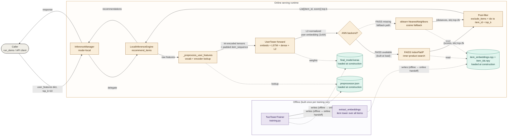

# recs_two_tower — architecture

A worked example of `explain_the_repo` applied to `~/Github/recs_two_tower`, a Keras-based two-tower deep-learning recommendation system. Produced under the doc design pass with a 5-section plan including a lifecycle section (the system has a clear offline-training vs online-serving split that warrants its own discussion).

The user request: *"Architecture doc for recs_two_tower — I want to explain it to a new ML engineer joining the team."*

---

# recs_two_tower — architecture

recs_two_tower is a Keras-based two-tower deep-learning recommendation system. Offline training writes a model + preprocessor + item-embedding artifacts; online serving loads them and answers `recommend(user_features, top_k)` calls via a user-tower forward pass plus an ANN search (FAISS or sklearn fallback) over the precomputed item embeddings. The architecturally interesting property is the offline / online lifecycle boundary: the item tower runs once, offline, over the entire item catalog; only the user tower runs per request, with the heavy retrieval cost paid as a precomputed index lookup.

## Where to start reading

- **`src/inference.py`** — the online serving path. `LocalInferenceEngine.recommend_items()` is the request handler; start here to follow a single recommendation call end-to-end.
- **`src/models.py`** — the two-tower model definition. `UserTower` and `ItemTower` are separate Keras models; `make_two_tower_model()` composes them for joint training.
- **`src/training.py`** — the offline training pipeline. `TwoTowerTrainer` owns the run; `extract_embeddings()` is the post-training step that runs the item tower over the catalog and writes `item_embeddings.npy`.
- **`run_demo.py` / `run_enhanced_demo.py` / `run_optimized_demo.py`** — entry points for end-to-end demos. `run_demo.py` is the simplest; the others enable optimization variants (graph-mode, pre-normalized embeddings).
- **`src/data_generator.py`** and **`src/data_preprocessing.py`** — synthetic data generation and preprocessing. Useful for reading "how does this turn user features into model inputs?"
- **`MLE_COMPREHENSIVE_GUIDE.md`** (in the repo) — long-form ML primer; useful for "why two-tower" context but not load-bearing for this architecture doc.

## Architecture overview

The doc design pass considered a 2-diagram set (offline training as a lifecycle sibling) but settled on a single-diagram architecture overview because the offline pipeline is more clearly explained as part of a dedicated **Lifecycle** section below — the headline overview should focus on the request that the user actually makes (online inference), with the offline pipeline appearing as the artifact-write source.

The diagram below traces a single online recommendation request through the local-mode serving path. Concrete entry point: a signed-in homeowner calls `service.recommend(user_features, top_k=10)` through the `LocalInferenceEngine`.

The semantic axis is offline-build vs online-serving — a lifecycle / trust boundary. The artifacts (`final_model.keras`, `preprocessor.json`, `item_embeddings.npy`) are loaded into the SERVING runtime at engine construction; they're the handoff surface between the two lifecycle zones, not a third zone of their own. The ANN backend selection (FAISS vs sklearn fallback) is drawn as a decision diamond fanning out to two branches; the fallback is dotted because FAISS is the primary path.

## Component summaries

- **`LocalInferenceEngine` (`src/inference.py`).** The online serving runtime. `recommend_items(user_features, top_k)` is the entry point. Owns the user-tower forward pass, ANN search, and post-filtering. Loads model, preprocessor, and item embeddings at construction (i.e., once per process); subsequent calls reuse the loaded artifacts.

- **`UserTower` and `ItemTower` (`src/models.py`).** Two separate Keras models with disjoint architectures. The user tower takes user features (categorical + sequence + numeric) and produces a 64-dim L2-normalized embedding. The item tower takes item features and produces a 64-dim L2-normalized embedding. They share no weights; they're trained jointly via a contrastive / cosine-similarity loss in `make_two_tower_model()`.

- **`TwoTowerTrainer` (`src/training.py`).** The offline training pipeline. `train()` runs end-to-end: loads training data, fits the joint two-tower model, saves the final Keras model. After training, `extract_embeddings()` runs the item tower over the entire item catalog and writes `item_embeddings.npy` + `item_ids.npy`. The item tower is never used at serving time — its work is precomputed.

- **`Preprocessor` (`src/data_preprocessing.py`).** Vocab and encoder logic. `preprocessor.json` (the artifact written by training) contains the vocabularies for categorical features and the encoders for sequence features (e.g., `item_sequence` padded to fixed length). Loaded by `LocalInferenceEngine` at construction.

- **ANN backends (FAISS, sklearn).** FAISS `IndexFlatIP` is the primary backend; built once at engine construction by feeding `item_embeddings.npy` to FAISS. Because user and item embeddings are L2-normalized, inner-product search equals cosine similarity. sklearn `NearestNeighbors` with cosine metric is the fallback, used when FAISS isn't installed (the `import faiss` ImportError path).

- **`VertexAIInferenceEngine` (`src/inference.py`).** The cloud-deployed alternative to `LocalInferenceEngine`. Out of scope for this doc — see `vertex_ai_deployment.md` if it exists.

## Lifecycle

The system has a clear offline-build / online-serve lifecycle split. Treating it as one runtime would muddle the design intent.

**Offline (per training run, typically nightly or on-demand):**

1. `TwoTowerTrainer.train()` reads training pairs (user features, item features, label), fits the joint two-tower model.
2. The fitted Keras model is saved to `final_model.keras`.
3. The preprocessor (vocabs, encoders) is saved to `preprocessor.json`.
4. `extract_embeddings()` runs the item tower over the entire item catalog, producing `item_embeddings.npy` and `item_ids.npy`.

**Artifact handoff:** the four files above are the handoff surface. The serving runtime reads them at construction; the offline pipeline writes them at end-of-training. No streaming sync — artifacts are loaded once per serving process startup.

**Online (per request):**

1. `LocalInferenceEngine.recommend_items()` receives `(user_features, top_k)`.
2. Preprocessor encodes user features into model-ready tensors.
3. User tower forward pass produces a single L2-normalized embedding.
4. ANN search (FAISS or sklearn) finds the top-2k nearest item embeddings.
5. Post-filter applies `exclude_items`, maps FAISS row indices back to original `item_id`, truncates to top-k.
6. Returns `List[(item_id, score)]`.

Critically: the **item tower never runs at serving time**. Its work was precomputed in step 4 of the offline phase. This is the architectural property that makes two-tower serving fast — the user-side model runs per request (cheap, single forward pass); the item side is amortized over the catalog size.

For systems where the item catalog updates frequently, the offline pipeline is rerun and the artifacts are replaced; serving processes typically restart to reload. There's no incremental embedding update path in this codebase.

## Out of scope

- **Vertex AI deployment.** `VertexAIInferenceEngine` and the `vector_search_endpoint` paths are an alternative serving topology, not used in the local-demo flow. See `full_deployment_pipeline.py` if present, or the project's deployment docs.
- **Optimized graph-mode variant.** `src/optimized_inference.py` provides a TF-graph-mode variant with pre-normalized embeddings and additional caching. Different performance profile, same architectural shape.
- **Cold start / no-FAISS / no-embeddings paths.** What happens if the engine loads but FAISS is missing AND sklearn fallback also fails? Brief — emits a clear error and refuses to serve. Worth documenting if operations focus is added.
- **Training data pipeline (`data_generator.py`).** Synthetic data generation for the demo. A real deployment would replace this with actual user-item interaction logs; the swap point is at `TwoTowerTrainer.fit()`'s input.
- **Model architecture rationale.** Why LSTM for `item_sequence`, why 64-dim, why these embedding sizes — covered in `MLE_COMPREHENSIVE_GUIDE.md` and not relevant for understanding *what runs where*.

Generation notes

Doc plan: 5 sections (Headline, Where to start reading, Architecture overview, Component summaries, Lifecycle, Out of scope = 6 with the wrapper). Doc-panel critique applied (substantive section count > 3); returned ship — sections cover the load-bearing aspects, lifecycle is correctly its own section rather than mixed into the architecture overview.

Architecture overview's diagram: single-diagram set with the offline-online lifecycle drawn as boundary-crossing arrows. Diagram-set design panel skipped (N=1). Per-diagram panel revised one issue across an earlier iteration (`wrong-trust-surface` on the original ARTIFACTS subgraph; folded into SERVING with explicit `(offline → online handoff)` labels). Current diagram panel-clean.

Per-section panels:
- Headline / Where to start reading / Component summaries / Lifecycle / Out of scope: prose, no panel (prose-only sections aren't panel-reviewed; the doc-level panel covers their composition).
- Architecture overview: panel-clean.

Total subagent calls: 1 (doc-level panel) + 2 (per-diagram panel) + 1 (syntax linter) = 4 critique calls.

