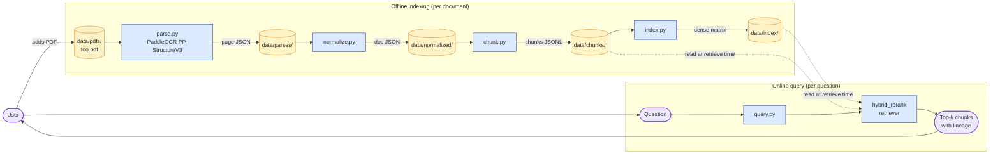

# Walkthrough — the v0.5 procedure on a contract-review repo

A walkthrough of the **doc-level skill** in `SKILL.md` — the v0.5 procedure end-to-end on a real codebase. This complements [`walkthrough.md`](walkthrough.md), which walks the inner diagram procedure, and the [`real-repos/`](real-repos/) examples, which show full doc outputs without the procedure narrative.

The example is the contract-review document AI pipeline used as the dogfood case during v0.5 development. The repo: PaddleOCR-based parsing, contract-aware normalization, multi-granularity chunks, hybrid retrieval with cross-encoder rerank, an eval harness with a 12-question golden set. ~2,000 lines of Python across 8 modules. The kind of system where every v0.5 mechanism — visual vocabulary, in-session-author detection, eval-surface section, reader test — has something to do.

This walkthrough exercises the **full procedure**: Phase 0 (pre-flight) → Phase A (doc design pass) → Phase B (per-section generation, with focus on one diagram-set section) → Phase C (skipped, see Phase 0a) → Phase D (reader test) → Phase E (output). Several phases get skipped because Phase 0a triggers; that's the point — the procedure handles in-session authorship gracefully and the walkthrough shows what that handling looks like.

## The user prompt

> *"Explain this repo — architecture doc for a new engineer."*

Working directory: `~/Github/contract-review`. The user has been building this system in the same Claude session that's now invoking the skill.

## Phase 0a — In-session-author detection

Before the doc design pass, the skill checks whether the current Claude session has authored the system being documented. Heuristics fire in order:

- **Session-edited source files.** `git log --since='4 hours ago' --author=Claude` returns 13 commits. Source files in `src/contract_review/` show edits within this conversation (every module from `parse.py` through `query.py` was authored or substantially modified in-session).
- **Conversation length.** The current session has built the entire pipeline across ~70 turns. Memory entries describe decisions made in this same session (e.g. "PaddleOCR Apple Silicon setup quirks").
- **Recent git activity.** All commits on `main` from `4019076` (initial vertical slice) through `fec6399` (README + ARCHITECTURE) were authored in this session.

All three signals fire strongly. **In-session authorship detected.**

Effect:
1. **Skip** Phase A's doc-panel critique, Phase B's per-diagram panel critiques (two-critic semantic review), and Phase C's doc-level panel.
2. **Keep** the syntax linter (mechanical, unaffected by context bias) and the reader test (intrinsically independent — fresh subagent with no source-code access).
3. **Emit** the in-session disclosure block in Phase E's generation notes (template field).

The skill notes this in the conversation:

> "I'm detecting that this session authored the contract-review repo (13 commits this conversation, all source modules edited in-session). I'll skip the panel critiques because in-context self-grading is unreliable even with subagents — recent context can leak in through summarization. The syntax linter and reader test (Phase D) still run; the reader test runs in a fresh subagent with no source access, which is exactly the protection it's designed to provide. The generation notes will include the disclosure block. Continuing."

If the heuristic had been ambiguous (some signal but not strong), the skill would have asked the user explicitly: *"Did this conversation author significant parts of this repo?"* The "ask the user when uncertain" path is the relief valve for the heuristic's noise.

## Phase 0b — Existing-docs scan

The skill scans the repo for existing documentation:

```
- README.md (1224 words): quick start, six CLIs, headline eval numbers, status/caveats.
- ARCHITECTURE.md (2347 words): pipeline diagram, full data shapes, per-component contracts,
  storage layout, extension points, performance characteristics, known limitations.
- docs/0_README.md through docs/9_meta_lessons.md (~11,700 words combined): 10-doc narrative
  series covering the journey from design brief to working system, with distilled lessons
  for similar AI dev work.
- discussion_perplexity.md: original Perplexity-sourced design brief.
```

Substantial overlap with the proposed new doc, especially with `ARCHITECTURE.md`. The skill surfaces the question:

> "Existing `ARCHITECTURE.md` already covers schemas, extension points, storage layout, and performance — the technical-reference shape. The `docs/` series covers the narrative journey. Should I (a) position the new doc as a stranger-onboarding companion (where-to-start, lifecycle, glossary, less schema depth), (b) replace the existing `ARCHITECTURE.md`, or (c) merge into the existing one?"

User picks (a) — complementary positioning. The new doc lands at `docs/architecture.md` (per the skill's default), with the README updated to link both.

This input flows into Phase A as the "Existing docs detected" item in the doc plan. Sections that would heavily duplicate ARCHITECTURE.md will be deliberately omitted with the overlap called out.

## Phase A — Doc design pass

Reading `references/doc-design-pass.md` for the section taxonomy and decision rules. Applying them to contract-review:

- **Component summaries** (rule 1): 7 distinguishable components (`parse.py`, `normalize.py`, `chunk.py`, `index.py`, `retrievers/`, `query.py`, `eval.py`). Include.
- **Data flow** (rule 2): the architecture overview's pipeline diagram already shows it. Skip as a separate section.
- **State and persistence** (rule 3): nontrivial — JSON-on-disk between every stage. Include, but check the merge rule.
- **Lifecycle** (rule 4): clean offline-vs-online split (offline: parse→normalize→chunk→index; online: query→retrieve→rerank). Include, but check the merge rule.
- **Lifecycle/state-and-persistence merge rule**: the offline lifecycle's outputs ARE the persisted state the online path reads. Apply the "remove one, does the other still make sense" test. Removing the persistence section leaves the lifecycle without grounding. Removing the lifecycle leaves the persistence without timing. **Both inform each other; they're partially separable. Decision: keep separate** — the lifecycle section emphasizes timing (~17s/page CPU, ~1s/query), the persistence section emphasizes topology (which file, who reads, who writes). The reader needs both lenses, and they don't fully reduce to one diagram.
- **Failure modes** (rule 5): user didn't ask for ops focus. Skip.
- **Test-and-eval-surface** (rule 6, new in v0.5): repo has `data/eval/golden.jsonl` (committed) and `eval.py` CLI. Trigger fires. Include.
- **Glossary** (rule 7): contract-aware schema has named terms (block_uid, section_id, chunk_type, doc_family, path-boost, RRF, cross-encoder rerank). > 5 domain terms a stranger won't know. Include.

Resulting section count: 8. Below the cap, no need to ask "doc set vs single doc."

### Visual vocabulary lock-in

After the section list is decided, the skill locks the visual vocabulary that all four diagrams will share:

```
Visual vocabulary (locked for the whole doc):

Colors:
  yellow #fef3c7  = persisted data (anywhere in this doc)
  blue   #dbeafe  = code / components
  purple #ede9fe  = user-facing I/O / system boundaries
  green  #d1fae5  = online cadence (when cadence is the axis)
  red    #fee2e2  = sparse-modality retrievers (specifically, BM25 in the retrieval ensemble diagram)
  dark-gold #fde68a = committed-to-repo (only golden.jsonl, in the persistence diagram)

Shapes:
  [Box]              = code component
  [(Cylinder)]       = persisted storage
  (["Stadium"])      = user-facing I/O / start/end nodes
  {{Hexagon}}        = transformation/algorithm (used once for RRF; flagged for GitHub render)

Stable axis assignments:
  yellow = persistence axis. Every persisted artifact is yellow regardless of section.
  blue = code axis. Every component module is blue regardless of section.
  shape = role. [Box] for code, [(Cylinder)] for storage, (["Stadium"]) for I/O — held across all four diagrams.
```

This block flows into each per-section diagram-procedure invocation as a constraint. Step 2 of the inner procedure must declare conformance and surface any need to extend.

### The full doc plan

```
DOC PLAN — contract-review: PDF → retrieval-with-citations pipeline for contracts

Existing docs detected (and what they cover):
- README.md: quick start, the six CLIs, eval numbers, status. (kept for product/install info)
- ARCHITECTURE.md: full data schemas, extension points, performance budgets. (kept for technical reference)
- docs/0_README.md through docs/9_meta_lessons.md: narrative journey + meta-lessons. (kept for reasoning context)

Sections (in order):
1. [headline] Headline paragraph: the system's role + the architecturally-interesting property
   (every stage persists JSON/numpy on disk → independently re-runnable, citation-grade lineage).
2. [where-to-start] Where to start reading: 6 file pointers including README, parse.py, retrievers/__init__.py,
   eval.py, golden.jsonl, docs/9_meta_lessons.md.
3. [architecture-overview, diagram-set] Architecture overview: invokes the diagram procedure with N=2
   (full pipeline cadence-split + retrieval ensemble zoom).
4. [component-summaries, prose] Component summaries: 7 components per the required template
   (responsibility / Surface / Boundary / Key files).
5. [lifecycle, hybrid] Lifecycle: prose + diagram. Offline indexing path vs online query path,
   per-stage timing.
6. [state-and-persistence, hybrid] State and persistence: prose + topology diagram. Each stage's
   write/read relationships with data/.
7. [test-and-eval-surface, prose] Test and eval surface: where data/eval/golden.jsonl lives,
   how to run eval.py, what hit@k / MRR / NDCG mean here, what the current numbers are.
8. [glossary, prose] Glossary: ~12 terms (block_uid, section_id, chunk_type, doc_family, etc.).
9. [out-of-scope] Out of scope: generation step, GPU serving, cross-doc retrieval, doc_family classifier.

Sections deliberately omitted (and why):
- data-flow: covered by the architecture overview's pipeline diagram.
- failure-modes: not in user request, no operations focus.
- (overlap with existing ARCHITECTURE.md: deferred to ARCHITECTURE.md for full schemas, extension
   points, performance budgets. The new doc's component summaries link there for depth.)

Visual vocabulary (locked for the whole doc):
[as above — 6 colors, 4 shapes, 3 stable axis assignments]

Estimated section count: 9. Reasoning: components + lifecycle + state-and-persistence + test-and-eval-surface
+ glossary (5 added beyond the always-included three) — each earned via decision rules 1, 4, 3, 6, 7.
```

User reviews the plan, approves with one note: "drop the explicit 'data-flow omitted' line, that's already implied by 'covered by architecture overview's pipeline diagram'." Plan adjusted; proceeding.

### Phase A's token-budget output

```
Doc plan finalized. Estimated token cost (9 sections, 4 diagrams):

  Phase A doc-panel critique:           SKIPPED (in-session detected)
  Phase B per-section generation:       ~6K × 9 sections   = ~54K
  Phase B per-diagram panel (×2):       SKIPPED (in-session detected)
  Phase B per-diagram syntax linter:    ~500 × 4 diagrams  = ~2K
  Phase C doc-level panel:              SKIPPED (in-session detected)
  Phase D reader test:                  ~3K
  Phase E output assembly:              ~1K

  Full path total (in-session-adjusted): ~60K tokens
  (Light path would have been ~58K; in-session detection has already reduced cost
   to near-light.)

  Proceed with full path / cancel?
```

User: *"proceed."*

## Phase B — Per-section generation (focus on architecture overview)

The seven prose sections are written first (where-to-start, components, lifecycle prose, persistence prose, test-and-eval-surface prose, glossary prose, out-of-scope) — straightforward applications of the section taxonomy with file-cited claims.

The interesting section is **architecture overview**, a diagram-set section with N=2. Showing the inner diagram procedure for the first diagram (the full-pipeline cadence-split) — abbreviated; the second diagram (retrieval ensemble zoom) follows the same pattern.

### Step 0 — Diagram-set design pass

Reading `references/diagram-set-design-pass.md`. Two diagrams:

- **Diagram 1** [headline, trace]: the full pipeline showing both offline and online cadences with the user closing the loop. Concrete entry point: a user adds a PDF and asks a question.
- **Diagram 2** [sibling, zoom]: the retrieval ensemble inside the `retrieve` step of diagram 1. Concrete entry point: a query with `--doc` filter, traced through `hybrid_rerank → hybrid → 3 base retrievers → RRF → cross-encoder → top-k`.

**Relationship**: Diagram 2 zooms one node from Diagram 1 (`retriever`). Aspects out of the set: the eval harness (separate concern), the model-download step on first parse, retry behavior.

Estimated set size: 2.

### Step 2 — Plain-text plan for diagram 1 (with v0.5 vocabulary conformance)

```
Concrete entry point
A user runs `python -m contract_review.parse data/pdfs/foo.pdf` (one-time per doc), then
`python -m contract_review.query "what is the governing law?" -d foo` (per question). The trace
shows both cadences with the user closing the loop.

The path
1. User → adds PDF to data/pdfs/
2. parse.py → page JSON in data/parses/
3. normalize.py → doc JSON in data/normalized/
4. chunk.py → chunks JSONL in data/chunks/
5. index.py → dense matrix in data/index/
   (offline complete)
6. User → asks a question via query.py
7. query.py → invokes hybrid_rerank
8. hybrid_rerank → reads data/chunks/ and data/index/ (dotted: read at retrieve time)
9. hybrid_rerank → returns top-k chunks with lineage
10. query.py → prints to user

The semantic axis
Cadence (offline indexing vs online query). Two subgraphs, each tinted.

Vocabulary conformance (v0.5)
Locked vocabulary for this doc:
- yellow = persisted data → applied to: data/pdfs/, data/parses/, data/normalized/, data/chunks/, data/index/ (all cylinders)
- blue = code → applied to: parse, normalize, chunk, index, query, retriever (all boxes)
- purple = user-facing I/O → applied to: user, question, answer (all stadiums)

Shape conformance:
- [Box] = code components ✓ (parse, normalize, chunk, index, query, retriever)
- [(Cylinder)] = persisted storage ✓ (5 cylinders for the data/ subdirectories)
- (["Stadium"]) = user-facing I/O ✓ (user, question, answer)
- {{Hexagon}} = NOT used in this diagram

No conflicts with prior diagrams in this doc (this is the first). No vocabulary extensions needed.

Out of scope
- Failure paths, retry behavior, model-weight downloads on first parse
- The eval harness (sits beside the pipeline, not inside the request flow)
- Multiple simultaneous queries (this is one user, not a load picture)
```

### Step 3-4 — Mermaid source



Step 4 cross-link check (v0.5 addition): this diagram will live in a GitHub README at `docs/architecture.md`. Reading `references/mermaid-patterns.md` § "Publishing to GitHub README":

- ✓ Simple shapes only (boxes, cylinders, stadiums; no hexagons in this diagram).
- ✓ 2 subgraphs (within cap of 3).
- ✓ No `direction` overrides inside subgraphs that conflict with the parent `LR`.
- ✓ Node labels ≤ 2 lines.
- ✓ Edge labels ≤ 15 chars.
- ✓ ~13 nodes (within 6-12 sweet spot, slightly over but acceptable).

### Step 6 — Per-diagram panel critique + syntax linter

**Per-diagram panel critique: SKIPPED (in-session detected per Phase 0a).**

**Syntax linter** runs in a subagent (mechanical, unaffected by context bias). Subagent reads `references/syntax-lint-prompt.md` plus the Mermaid source. Output:

```json
{"all_clear": true, "auto_fixes": [], "manual_fixes": []}
```

Diagram 1 syntax-clean. Same procedure runs for diagram 2 (retrieval ensemble zoom); also clean.

The two diagrams are embedded in the architecture-overview section with prose framing and the visual-vocabulary key called out in the captions ("color encodes role: blue = code, yellow = storage, purple = I/O").

## Phase C — Doc-level review

**SKIPPED (in-session detected per Phase 0a).** Phase D (reader test) runs unconditionally and provides the doc-level coverage that Phase C would have.

## Phase D — Reader test

Generating the five questions for this specific doc. Per `references/reader-test-prompt.md`:

- Q1 (universal): *"If I'm new to this codebase, what file should I read first and why?"*
- Q2 (per-doc): pick a load-bearing component. The architecture-overview pipeline diagram has `parse.py` and `retriever` as the most-edged nodes; component-summaries lists `parse.py` first. Pick `parse.py`. Question: *"What does `parse.py` do, and what does it deliberately not do?"*
- Q3 (per-doc): pick the headline trace's boundaries. Diagram 1's user-to-user trace goes PDF → top-k chunks. Question: *"How does data move from a contract PDF to top-k retrieved chunks through this system?"*
- Q4 (universal): *"What persists between runs of this system, and where does it live?"*
- Q5 (universal): *"What is deliberately out of scope for this system, and where would I look for that information instead?"*

Spawn fresh subagent — **no source-code access, no prior conversation**. Hand it `references/reader-test-prompt.md`, the produced doc (full markdown including diagrams), and the five questions.

The subagent reads, role-plays as a new engineer onboarding, and returns:

```json
{
  "verdict": "borderline",
  "questions": [
    {
      "question": "If I'm new to this codebase, what file should I read first and why?",
      "status": "answered",
      "evidence_in_doc": "Where to start reading section, bullet 1: 'README.md — quick start, the six CLIs, and the headline eval numbers. The fastest on-ramp.' The section lists 6 specific files with one-line reasons each.",
      "gap": null
    },
    {
      "question": "What does parse.py do, and what does it deliberately not do?",
      "status": "answered",
      "evidence_in_doc": "Component summaries section, parse.py subsection. Responsibility: 'Runs PaddleOCR PP-StructureV3 page-by-page on a PDF, dumps per-page raw JSON and Markdown.' Surface: 'CLI python -m contract_review.parse FILE.pdf'. Boundary: 'doesn't normalize, doesn't classify, doesn't know about contracts'. Key files: src/contract_review/parse.py.",
      "gap": null
    },
    {
      "question": "How does data move from a contract PDF to top-k retrieved chunks through this system?",
      "status": "answered",
      "evidence_in_doc": "Architecture overview, diagram 1 (full pipeline) and the prose preceding it. PDF → parse.py → page JSON → normalize.py → doc JSON → chunk.py → chunks JSONL → index.py → dense matrix; then on the query side, question → query.py → hybrid_rerank retriever (which reads chunks JSONL and dense matrix) → top-k chunks with lineage. Diagram 2 zooms the retriever stage.",
      "gap": null
    },
    {
      "question": "What persists between runs of this system, and where does it live?",
      "status": "answered",
      "evidence_in_doc": "State and persistence section, with topology diagram. Five persisted artifacts (PDFs, parses, normalized JSON, chunks JSONL, dense index) all under data/, all gitignored except data/eval/golden.jsonl which is committed. The diagram shows the read/write topology between code and data/.",
      "gap": null
    },
    {
      "question": "What is deliberately out of scope for this system, and where would I look for that information instead?",
      "status": "partial",
      "evidence_in_doc": "Out of scope section names six things: generation step, high-throughput serving, cross-doc retrieval at scale, real doc-family classifier, GPU-backed parsing/reranking, operations runbook. For 'why the system has this shape' it points to docs/0_README.md through 9_meta_lessons.md. ARCHITECTURE.md is mentioned for technical reference.",
      "gap": "The 'where to find that information instead' clause is incomplete for several items. The 'generation step' is described as 'sketched in docs/9_meta_lessons.md' but I couldn't locate the specific section. 'GPU-backed parsing' is mentioned but no pointer to where to start. A reader looking for 'how to add a generation step' would need to grep the docs."
    }
  ],
  "doc_quality_summary": "Doc onboards well on the first four questions with specific file pointers and component-summary template discipline visible. Question 5 returned partial because the out-of-scope section names what's not covered but is uneven about where to find it instead — a few items have 'see docs/X' pointers, others don't. Recommend tightening the out-of-scope section to ensure every named exclusion has either a pointer or a 'not yet documented' acknowledgment."
}
```

Verdict: **borderline**. One question returned `partial`; none returned `cant-answer`. Per the filter: ship; surface the gap in generation notes; do not revise.

(If the verdict had been `revise`, the bounded one-round revision would target the out-of-scope section specifically — regenerate it with the gap as additional input. The reader test would not re-run after revision; bounded to one round.)

## Phase E — Output

The doc is assembled. Generation notes block at the end of the file:

```
<details>
<summary>Generation notes</summary>

**Doc plan.** 9 sections: headline, where-to-start, architecture overview (diagram-set N=2),
component summaries, lifecycle, state and persistence, test-and-eval-surface, glossary,
out-of-scope. Existing docs detected: README.md, ARCHITECTURE.md, docs/0_README.md through
9_meta_lessons.md. Visual vocabulary: 6 colors locked (yellow=storage, blue=code, purple=I/O,
green=online cadence, red=sparse-modality, dark-gold=committed-to-repo); 4 shapes locked
(box=code, cylinder=storage, stadium=I/O, hexagon=transformation, used once).

**Phase 0a — In-session-author detection.** Triggered. Panel critiques (doc-level and per-diagram)
were skipped because in-context self-grading is unreliable; the syntax linter and reader test
still ran. To get the full panel-critique procedure, invoke this skill in a fresh session with
no prior context on this repo.

**Phase A doc-panel critique.** Skipped (in-session).

**Phase B per-section diagram panels.** Skipped (in-session) for both architecture-overview
diagrams and the lifecycle/persistence diagrams.

**Phase B syntax linter.** All clear across 4 diagrams.

**Phase C doc-level panel.** Skipped (in-session).

**Phase D reader test.** Borderline: 4/5 answered cleanly; question 5 (out-of-scope pointers)
returned partial — the section names exclusions but is uneven about where to find them instead.
Did not revise (bounded to one round; partial verdict ships per filter).

</details>
```

The doc lands at `docs/architecture.md`. README.md is updated to point to both `docs/architecture.md` (stranger-onboarding) and `ARCHITECTURE.md` (technical reference) with their distinct roles.

---

## What this walkthrough demonstrates about v0.5

1. **In-session-author detection short-circuits the heavy critique paths gracefully.** The procedure didn't grind to a halt; it shed the panels and ran the rest. Token cost dropped from ~120K (full path with all panels) to ~60K. The disclosure block in the generation notes makes the trade-off auditable for future readers.

2. **The visual vocabulary lock-in carries across four diagrams.** A reader of `docs/architecture.md` learns one color/shape mapping (yellow=persistence, blue=code, purple=I/O, cylinder=storage, etc.) and that mapping holds in the architecture overview, the retrieval ensemble zoom, the lifecycle timeline, and the persistence topology. No relearning per diagram.

3. **The reader test catches a real, specific doc gap.** Even with the rest of the procedure clean, question 5 surfaced a tightenable spot in the out-of-scope section. A panel critique would have flagged "out-of-scope section is too thin on pointers" if it could see the gap; the reader test catches it specifically because it's simulating the stranger's experience.

4. **The test-and-eval-surface section earned its place.** The repo had `data/eval/golden.jsonl` committed and an `eval.py` CLI; the v0.5 decision rule fired; the doc now has a section a stranger can land on when wondering "how do I verify changes here?" Without v0.5, that section would have been folded into where-to-start at best and missed at worst.

5. **Component-summary template enforcement was load-bearing in the reader test.** Question 2 ("what does parse.py do, and what does it deliberately not do?") got `answered` because the template's Boundary line was present. Without the template, that question commonly returns `partial` — the doc says what a component does but not what it doesn't.

## What this walkthrough does NOT show

- **A panel critique full run.** Both Phase A's pre-generation panel and Phase C's doc-level panel were skipped via Phase 0a. To see those, run the skill in a fresh session against any repo where you didn't author the code.
- **A `revise` reader-test verdict.** This run returned `borderline`. To see the bounded revision flow, set up a doc with a deliberately gappy section (e.g., omit the out-of-scope section entirely) and run the reader test against it — the substituted Q4 in such cases (when state-and-persistence is also omitted) would expose multiple gaps simultaneously and trigger `revise`.
- **The light-path token budget.** Phase A's budget output showed full path vs light path numbers, but in-session-author detection had already collapsed the panel costs to zero, so the user's choice didn't change anything. On a fresh-session run against a 9-section doc with 4 diagrams, the light path would save ~60K tokens (full ~120K → light ~60K).

The rest is downstream of running the skill on your own repo.
