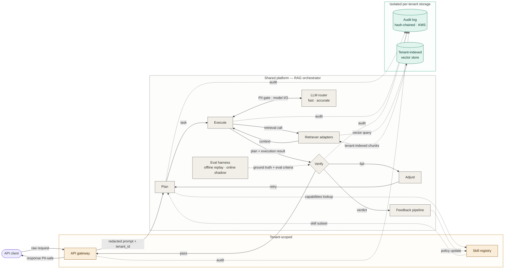

# Walkthrough — the inner diagram procedure on a multi-tenant RAG service

A complete walkthrough of the **inner diagram procedure** in `references/diagram-procedure.md` — the steps that run when the `explain_the_repo` skill (or a standalone "draw a diagram of X" request) needs to produce a Mermaid diagram set. The example is a generic multi-tenant retrieval-augmented generation service — a public-domain reference architecture with no proprietary content.

This walkthrough exercises a **single-diagram set (N=1)** within the inner procedure. The full architecture-doc skill (with the doc design pass deciding *which sections* a doc needs, and per-section generation that invokes this inner procedure for diagram sections) is walked through more fully in the [`real-repos/`](real-repos/) examples — see [`real-repos/autoresearch.md`](real-repos/autoresearch.md) for a multi-diagram-set case and [`real-repos/graphql-node.md`](real-repos/graphql-node.md) for a single-diagram architecture doc.

In the original skill (before the `explain_the_repo` rename), this walkthrough was the canonical walk-through. It still holds for the inner diagram procedure unchanged; the outer doc-level wrapping is what's new.

For an end-to-end walk of the **outer doc-level procedure** including the v0.5 mechanisms (in-session-author detection, existing-docs scan, visual-vocabulary lock-in, reader test, generation-notes block), see [`v0.5-walkthrough.md`](v0.5-walkthrough.md). That walkthrough exercises Phase 0 through Phase E on a real codebase; this one exercises the inner procedure (steps 0 through 6) in isolation.

## The user prompt

> *"Draw a system diagram for a request flowing through a multi-tenant retrieval-augmented generation service. The platform has an API gateway that does PII redaction, a shared orchestrator with plan/execute/verify/adjust stages, an LLM router with cost tiers, retriever adapters that hit a tenant-scoped vector store, an eval harness, a feedback pipeline that updates a skill registry, and a per-tenant hash-chained audit log."*

## Step 0 — Design pass

The system has multiple cadences (sync request flow + the cross-run feedback loop running at a different timescale) and a load-bearing internal structure (plan/execute/verify/adjust loop). The design pass weighs whether this needs a set:

- **Cross-run feedback** is a real cadence sibling candidate, but the feedback loop here is fairly thin (eval harness → feedback pipeline → skill registry) and can be drawn as a side-channel on the headline trace via dotted edges. Below the "would only have 3–4 nodes" threshold for a sibling.
- **Plan/execute/verify/adjust loop** is structural but is the *core* of the headline trace, not a separable component to zoom.
- **No persistent state to topology-diagram** beyond the audit log and the per-tenant vector store, both of which the trace touches.

Conclusion: **N=1**, single-diagram set. Headline trace covers the request flow with the feedback loop as a side-channel. No design-panel critique needed (skipped for N=1).

> "I'll draw this as a single-diagram request trace — one client request flowing from the API gateway back to the API gateway. The cross-run feedback loop appears as a dotted side-channel rather than a sibling diagram. Failure recovery and batch reindexing are out of scope; I'll mention them as candidates for sibling diagrams if the user asks for those aspects."

## Step 1 — Pick the diagram's specific job

Step 0 assigned this diagram the trace archetype. Step 1 narrows to the specific instance: which request, from where to where.

The prompt names cross-cutting concerns (PII redaction, audit logging, multi-tenancy) that should be on edges, not as peer boxes. The plan/execute/verify/adjust stages form a loop within the orchestrator that needs to be drawn as a real loop with the verify decision visible, not as a stack.

> "Concrete entry point: a client request enters the API gateway, gets PII-redacted, flows through plan→execute→verify with retries via adjust on verify-fail, and exits via the gateway with a response. The cross-run feedback channel (eval harness → feedback pipeline → skill registry) is a dotted side-channel."

## Step 2 — Plan the trace in plain text

### Concrete entry point
An API client makes an inference request to the RAG service.

### The path (in order)
1. API client (external)
2. API gateway — PII redaction, tenant_id stamping
3. Plan stage — consults Skill Registry to resolve required capabilities
4. Execute stage — calls LLM router (with PII gate on I/O) and retriever adapters
5. Retriever adapters — query the per-tenant vector store, return relevant chunks
6. Verify stage — gets ground truth from Eval Harness, decides pass or fail
7. Adjust (if fail) — feeds back into Plan as a retry
8. API gateway again (if pass) — sends PII-safe response back
9. API client receives response

### The semantic axis: trust boundary

Three zones, each its own color:
- **Tenant-scoped** (amber): API gateway, Skill Registry — these have tenant identity
- **Shared platform** (gray): all orchestrator stages (plan / execute / verify / adjust), LLM router, retriever adapters, eval harness, feedback pipeline — these serve all tenants
- **Per-tenant isolated storage** (teal): Audit log, vector store — these are physically isolated per tenant

This is the most natural axis because it maps to how a security or compliance reviewer would read the diagram.

### Out of scope
- Failure recovery / circuit breakers / retries beyond the verify→adjust loop — separate diagram
- Batch reindexing of the vector store — separate diagram, different cadence
- Observability infrastructure (logs, metrics, distributed traces) — implied by the audit log, not the same thing
- Multiple simultaneous tenants — this is one request, not a load picture

## Step 3 — Map to Mermaid primitives

Mechanical translation:

- API client → `([Pill])` (external actor)
- API gateway, Skill registry → `[Box]` in `subgraph TENANT`
- Plan, Execute, Adjust, LLM router, Retriever adapters, Eval harness, Feedback pipeline → `[Box]` in `subgraph CORE`
- Verify → `{Diamond}` (it's a decision: pass or fail)
- Audit log, Vector store → `[(Cylinder)]` in `subgraph STORE`

Edges:
- Solid `-->` for the main request flow
- Dotted `-.->` for lookups (skill registry), audit writes, and the cross-run feedback signal
- Bidirectional `<-->` for LLM I/O (request goes out, response comes back, both pass through PII redaction)
- Edge labels on every cross-subgraph boundary

Cross-cutting concerns:
- PII redaction → label on the `gw → plan` edge ("redacted prompt + tenant_id") and on the `exec ↔ llm` edge ("PII gate · model I/O")
- Audit logging → single `audit` sink, four dotted incoming arrows from Plan, Execute, Verify, Gateway
- Tenant isolation on the vector store → labeled on the dotted `tools → rag` edge

Architectural choices made visible:
- The plan-execute-verify-adjust loop is a real loop: Verify can branch to Adjust, which retries via Plan
- The cross-run feedback path is shown but visually separated (different layer in the layout, dotted edge to a tenant-scoped node)

## Step 4 — Render with elk

## Step 5 — What's deliberately not in this diagram

Three sibling diagrams could follow, each with its own cadence and scope:

- **Failure recovery** — what happens when Verify keeps failing, when a retrieval times out, when the LLM provider returns rate-limit. Different shape (lots of conditional branches), different cadence (per-failure, not per-request).
- **Batch reindexing / retraining** — the periodic job that aggregates the feedback pipeline's output into a retraining queue, runs evals offline, updates the skill registry's policy, and rebuilds vector indexes. Different cadence (minutes to days), different participants (data engineering, not request serving).
- **Multi-tenant isolation review** — the same components but drawn for a security audit, with every isolation control surfaced (KMS keys, network policies, encrypted-at-rest stores, tenant-scoped IAM). Different audience (compliance), same components, different emphasis.

If a user asks for any of these, draw a separate diagram — don't try to add to this one.

## Step 6 — Panel critique + syntax lint + bounded revision

After the diagram is produced, three subagents run in parallel: two panel critics (each reading `references/panel-prompt.md` and applying the four-panelist procedure) and one syntax linter (reading `references/syntax-lint-prompt.md`). The diagram-level panel runs separately from step 0's design-panel; this is the per-diagram critique, not the set composition critique.

For this single-diagram set with this trace, the panel summary would typically read:

> *"Panel clean — Trace Reader, Visual Encoding Critic, Scope Steward, and the SME (Platform / SRE engineer) all returned ship. Syntax linter all clear."*

Or with one borderline issue surfaced:

> *"Panel clean on structure (return arrow exists, single sync cadence, trust-axis honest with three subgraphs cleanly separated). One borderline issue surfaced: `noun-inventory` at 12 nodes (right at the soft-band threshold — driven by the four-stage plan/execute/verify/adjust loop and the fan-out to LLM router tiers; consolidating would bury structural choices). Syntax linter all clear."*

If the panel had flagged a revision-worthy issue (`out-of-scope-sprawl`, `wrong-trust-surface`, etc.), step 6 would regenerate the diagram once with the issue injected as an additional constraint into step 2's "Out of scope" list, then re-run only the syntax linter on the revised source. The revision is bounded to one round.
